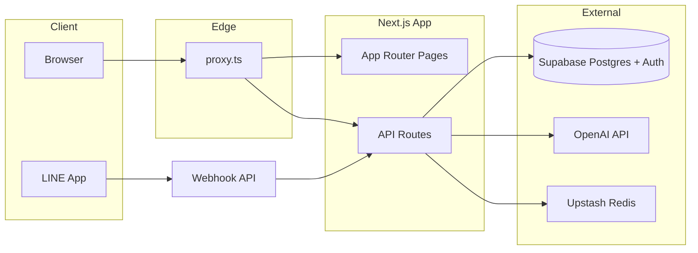
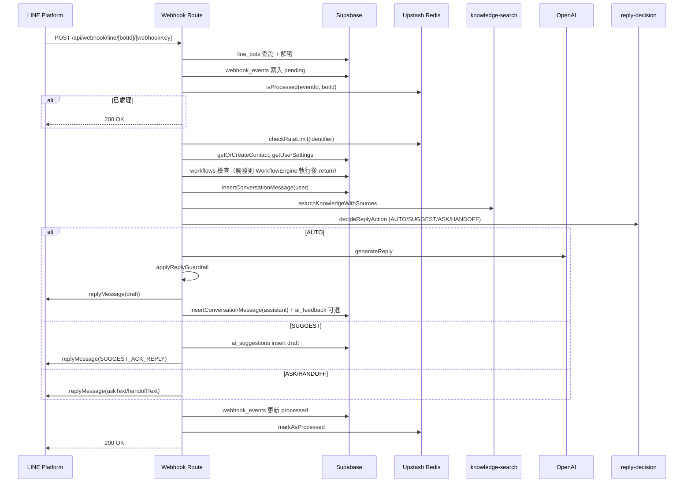
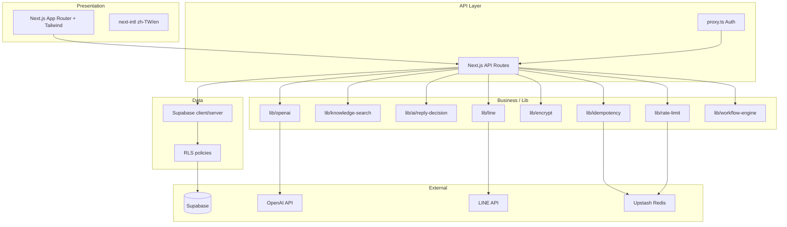

# CustomerAIPro SaaS 專案藍圖

本藍圖涵蓋四部分：**系統運作方式**、**客戶使用時的前後端路線**、**DevOps 路線**、**全端技術路線**。所有路徑與檔案以 repo 為準（[docs/NOTION_SYNC.md](docs/NOTION_SYNC.md)、[proxy.ts](proxy.ts)、[app/api/webhook/line](app/api/webhook/line)）。

---

## 1. 系統如何運作（How Everything Works）

### 1.1 高層架構

- **前端**：Next.js 16 App Router，`app/[locale]/` 下為多語系頁面（zh-TW / en），Tailwind CSS，next-intl。
- **入口**：所有非靜態請求先經 [proxy.ts](proxy.ts)（Next.js 16 的 middleware 替代），負責：
  - **API**：非公開路徑（`/api/webhook/`、`/api/health`、`/api/auth/` 除外）需 Supabase 登入，否則 401。
  - **頁面**：`/dashboard`、`/settings` 需登入，否則導向 `/[locale]/login`；已登入且未完成 onboarding 則導向 `/[locale]/dashboard/onboarding`。
  - **i18n**：next-intl middleware 處理 locale。
  - **安全標頭**：X-Frame-Options、CSP、HSTS（production）等。
- **後端**：約 85 個 API route 在 `app/api/`，依功能分為：Auth、Settings、Knowledge Base、Webhook/Chat、Contacts/Tags、Conversations/Suggestions、Analytics、Billing、Workflows、Campaigns、Health/Cron 等。
- **資料與認證**：Supabase（PostgreSQL + Auth）。RLS 全表開啟，以 `user_id`/`auth.uid()` 隔離租戶。
- **AI**：OpenAI GPT-4o-mini，透過 [lib/openai.ts](lib/openai.ts) 的 `generateReply`；知識庫 RAG 用 [lib/knowledge-search.ts](lib/knowledge-search.ts)。
- **LINE**：多 Bot 使用 `/api/webhook/line/[botId]/[webhookKey]`；驗簽、解密密鑰、事件處理在 [app/api/webhook/line/route.ts](app/api/webhook/line/route.ts) 的 `handleEvent`。
- **冪等與限流**：Upstash Redis（未設定則記憶體 fallback）；multi-bot production 強烈建議必填 Redis。

### 1.2 LINE 訊息到 AI 回覆的資料流

- **決策層**（[lib/ai/reply-decision.ts](lib/ai/reply-decision.ts)）：依知識庫來源數、信心度、風險類別（退款/折扣等）決定 AUTO / SUGGEST / ASK / HANDOFF，高風險不自動直送。
- **儲存**：聯絡人、對話、建議草稿、webhook_events、workflow_logs 等皆落庫；Analytics 快取可於事件後失效。

### 1.3 主要資料表（Supabase）

| 領域         | 表名                                                  | 用途                                      |
| ---------- | --------------------------------------------------- | --------------------------------------- |
| 使用者        | users                                               | 帳號、system_prompt、onboarding_completed 等 |
| 聯絡人／對話     | contacts, conversations                             | LINE 用戶、對話紀錄與狀態                         |
| 知識庫        | knowledge_base                                      | RAG 來源                                  |
| LINE 多 Bot | line_bots, webhook_events                           | Bot 設定、webhook 事件佇列                     |
| AI 副駕      | ai_suggestions, ai_feedback, ai_guidance_rules      | 建議草稿、回饋、指引規則                            |
| 訂閱／計費      | plans, subscriptions, payments                      | 方案與使用量                                  |
| 工作流程       | workflows, workflow_logs                            | 自動化流程與日誌                                |
| 其他         | campaigns, ab_tests, conversation_notes, api_keys 等 | 行銷、A/B 測試、備註、API 金鑰                     |

---

## 2. 客戶使用時的前後端路線（Customer Journey Roadmap）

### 2.1 使用者類型與入口

- **訪客**：Landing（`app/[locale]/page.tsx`）→ Login / Sign up（Supabase Auth）或 LINE OAuth（`/api/auth/line` → callback）。
- **已登入未完成 onboarding**：proxy 導向 `/[locale]/dashboard/onboarding`；前端呼叫 `GET/POST /api/onboarding/status`、`/api/onboarding/save`。
- **已登入**：可進入 Dashboard 與 Settings；所有 Dashboard/Settings 頁面與非公開 API 皆需 Cookie 內 Supabase session。

### 2.2 前端路線（依路徑）

| 路徑                                                           | 檔案                                               | 主要後端 API                                                                                 |
| ------------------------------------------------------------ | ------------------------------------------------ | ---------------------------------------------------------------------------------------- |
| `/`, `/pricing`, `/terms`, `/privacy`                        | `app/[locale]/page.tsx`, pricing, terms, privacy | —                                                                                        |
| `/login`, `/forgot-password`                                 | login, forgot-password                           | Supabase Auth（client）                                                                    |
| `/dashboard`                                                 | dashboard/page.tsx                               | analytics/overview、conversations/counts、billing/usage 等                                  |
| `/dashboard/onboarding`                                      | onboarding/page.tsx                              | onboarding/status, save                                                                  |
| `/dashboard/knowledge-base`                                  | knowledge-base/page.tsx                          | knowledge-base（CRUD）、import、test、gap-analysis、search、stats                               |
| `/dashboard/conversations`                                   | conversations/page.tsx, [contactId]/page.tsx     | conversations/counts、contacts、conversations/[id]/suggestions、reply、suggestions/[id]/send |
| `/dashboard/contacts`                                        | contacts/page.tsx                                | contacts、contacts/tags、contacts/[id]/tags                                                |
| `/dashboard/analytics`                                       | analytics/page.tsx                               | analytics/overview、trends、resolution、export 等                                            |
| `/dashboard/billing`                                         | billing/page.tsx                                 | billing/usage、plans、subscription、payments                                                |
| `/dashboard/settings`                                        | settings/page.tsx                                | settings、settings/preview                                                                |
| `/dashboard/settings/bots`                                   | settings/bots/page.tsx                           | settings/bots、settings/bots/[id]、bots test                                               |
| `/dashboard/campaigns`, automations, ai-quality, system-test | 對應 page                                          | campaigns、workflows、analytics/ai-quality、health-check 等                                  |
| `/help`, `/help/[category]/[article]`                        | help/*                                           | 靜態內容（lib/help-articles.ts）                                                               |

### 2.3 後端路線（依客戶操作）

- **登入／綁定**：`/api/auth/line`、`/api/auth/line/callback`、`/api/auth/line/unbind`（公開）。
- **設定**：`/api/settings`、`/api/settings/line`、`/api/settings/bots`、`/api/settings/preview` 等。
- **知識庫**：`/api/knowledge-base` 的 GET/POST、`/api/knowledge-base/[id]`、import、import-url、test、search、gap-analysis、from-conversation。
- **對話與建議**：`/api/conversations/counts`、`/api/conversations/[id]/suggestions`、`/api/conversations/[id]/reply`、`/api/suggestions/[id]/send`、handback、takeover。
- **聯絡人／標籤**：`/api/contacts`、`/api/contacts/[id]`、`/api/contacts/tags`、`/api/contacts/[id]/tags`。
- **分析與帳單**：`/api/analytics/`*、`/api/billing/usage`、`/api/plans`、`/api/subscription`、`/api/payments`。
- **LINE 端客戶**：僅透過 LINE 發訊；後端由 **Webhook** 處理（見 1.2），Dashboard 僅「查看／回覆／送出建議」對應上述 conversations/suggestions/reply API。

---

## 3. DevOps 路線（DevOps Roadmap)

### 3.1 CI（GitHub Actions）

- **檔案**：[.github/workflows/ci.yml](.github/workflows/ci.yml)。
- **觸發**：`pull_request` / `push` 到 `main`、或手動 `workflow_dispatch`。
- **步驟**：checkout → Node 20 → `npm ci` → **type-check** → **lint** → **unit tests** → **build**（約 15 分鐘 timeout）。
- **環境**：CI 內建 dummy 的 Supabase / OPENAI 等變數，僅供 build 通過。

### 3.2 部署

- **平台**：Vercel，連線 GitHub repo（main）。
- **流程**：push main → Vercel 自動 build + deploy；正式網址 [https://www.customeraipro.com。](https://www.customeraipro.com。)
- **環境變數**：Vercel 專案 Settings → Environment Variables（與 [docs/DEPLOYMENT_AND_ENV_FAQ.md](docs/DEPLOYMENT_AND_ENV_FAQ.md) 對齊）；multi-bot production 必填 Upstash Redis 與 `LINE_BOT_ENCRYPTION_KEY`。

### 3.3 Cron（Vercel）

- **設定**：[vercel.json](vercel.json)。
- `/api/health-check`：每 15 分鐘（`*/15` * * * *）。
- `/api/cron/cleanup-webhook-events`：每日 03:00（`0 3` * * *）；建議設定 `WEBHOOK_CLEANUP_CRON_SECRET` 驗證。

### 3.4 測試與品質

- **單元測試**：`npm run test:unit:run`（38 個，含 reply-decision、knowledge-search、元件等）。
- **E2E**：Playwright 在 `e2e/`，支援本地與 production 模式。
- **程式碼品質**：CodeQL、dependency-review 在 CI（若已啟用）；branch protection 建議依 [docs/BRANCH_PROTECTION.md](docs/BRANCH_PROTECTION.md) 設定。

### 3.5 維運檢查清單

- 定期確認 Supabase 狀態（RLS、migrations、DB 大小）。
- 確認 Vercel 部署與 Cron 執行正常。
- 監控 LINE webhook 日誌（冪等、rate limit、錯誤回覆）。
- 依 [.cursor/rules/engineering-status.mdc](.cursor/rules/engineering-status.mdc) 處理 P0/P1 技術債（test API 移除、RLS 優化、FK 索引等）。

---

## 4. 全端技術路線（Full Stack Roadmap）

### 4.1 技術棧分層

### 4.2 關鍵檔案對應

| 層     | 路徑                                                                     | 說明                                            |
| ----- | ---------------------------------------------------------------------- | --------------------------------------------- |
| 入口    | proxy.ts                                                               | Auth、locale、onboarding 導向、安全標頭                |
| 前端    | app/[locale]/**/*.tsx                                                  | 頁面與 layout；Landing 元件在 app/components/landing |
| API   | app/api/**/route.ts                                                    | 85+ 端點，依功能分組                                  |
| 認證    | lib/supabase/server.ts, client.ts, auth-helper.ts                      | 服務端/客戶端 Supabase、從 request 取 user             |
| AI    | lib/openai.ts, lib/knowledge-search.ts, lib/ai/reply-decision.ts       | 回覆生成、RAG、決策層                                  |
| LINE  | lib/line.ts, lib/encrypt.ts                                            | 驗簽、回覆、Bot 憑證加解密                               |
| 冪等／限流 | lib/idempotency.ts, lib/rate-limit.ts                                  | Redis 或記憶體                                    |
| 方案與用量 | lib/plans.ts, lib/billing-usage.ts                                     | 方案上限、對話用量                                     |
| 安全    | lib/security/sensitive-keywords.ts, output-filter.ts, secure-prompt.ts | 敏感詞、輸出過濾、安全 prompt                            |

### 4.3 安全與多租戶

- **認證**：Supabase Auth（Cookie）；API 經 proxy 或 route 內 `getUser()` 檢查。
- **多租戶**：RLS 以 `user_id` / `auth.uid()` 隔離；Bot 以 `line_bots.user_id` 關聯。
- **敏感資料**：Bot channel secret/token 以 AES-256-GCM 存 DB（[lib/encrypt.ts](lib/encrypt.ts)）；webhook key 以 hash 比對。
- **限流與冪等**：避免重複處理與濫用；production 多 Bot 依賴 Redis。

### 4.4 後續可優化方向（對齊技術債）

- RLS 改為 `(select auth.uid())` 與 FK 索引（migrations 草稿已有）。
- Auth redirect 改為 locale-aware（forgot-password、LINE callback）。
- sitemap hreflang、CSP 收緊（nonce/strict-dynamic）。
- Supabase types 自動生成、移除 legacy getSupabase()。
- 依 [docs/DEEP_DIVE_IMPROVEMENTS.md](docs/DEEP_DIVE_IMPROVEMENTS.md) 與 engineering-status.mdc 的 P2/P3 排程。

---

## 產出建議

- 可將本藍圖另存為 **docs/PROJECT_BLUEPRINT.md**，與 NOTION_SYNC、PROJECT_STRUCTURE、API_ENDPOINTS 並列，方便 onboarding 與維運對照。
- 若需「單一客戶從註冊到在 Dashboard 回覆一條 LINE 訊息」的逐步流程，可再從本文件 2.2、2.3 擷取為單頁 Customer Journey 流程圖（含前後端對照）。

