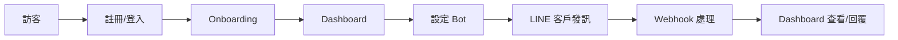

# 單一客戶從註冊到在 Dashboard 回覆一條 LINE 訊息 — 逐步流程

本文件從藍圖 2.2、2.3 擷取，描述**單一客戶（商家）**從註冊、完成 onboarding、設定 LINE Bot、到在 Dashboard 回覆一條 LINE 訊息的完整前後端對照流程。

---

## 流程總覽

---

## 步驟 1：訪客 → 註冊／登入

| 端 | 動作 | 路徑／API |
|----|------|------------|
| **前端** | 使用者開啟首頁或點「登入」 | `/[locale]` 或 `/[locale]/login`（`app/[locale]/page.tsx`、`app/[locale]/login/page.tsx`） |
| **前端** | 填寫 email／密碼或選擇 LINE 登入 | Supabase Auth（client）或導向 `/api/auth/line` |
| **後端** | 若選 LINE 登入：導向 LINE OAuth | `GET /api/auth/line` |
| **後端** | LINE 回傳 code 後換 token、建立/取得 user | `GET /api/auth/line/callback` |
| **前端** | 登入成功後 proxy 導向 dashboard（若未完成 onboarding 則先導向 onboarding） | — |

---

## 步驟 2：已登入未完成 onboarding → 完成引導

| 端 | 動作 | 路徑／API |
|----|------|------------|
| **proxy** | 偵測 `onboarding_completed !== true`，導向 onboarding 頁 | `/[locale]/dashboard/onboarding`（`app/[locale]/dashboard/onboarding/page.tsx`） |
| **前端** | 顯示 onboarding 表單（店名、產業等） | — |
| **後端** | 讀取／儲存 onboarding 狀態 | `GET /api/onboarding/status`、`POST /api/onboarding/save` |
| **後端** | 更新 `users.onboarding_completed = true` | 同上 save |
| **前端** | 完成後進入 Dashboard 首頁 | `/[locale]/dashboard` |

---

## 步驟 3：進入 Dashboard 與設定 LINE Bot

| 端 | 動作 | 路徑／API |
|----|------|------------|
| **前端** | 進入儀表板首頁 | `/[locale]/dashboard`（`app/[locale]/dashboard/page.tsx`） |
| **後端** | 取得總覽與計數 | `GET /api/analytics/overview`、`GET /api/conversations/counts`、`GET /api/billing/usage` 等 |
| **前端** | 前往設定 Bot | `/[locale]/dashboard/settings/bots`（`app/[locale]/dashboard/settings/bots/page.tsx`） |
| **後端** | 列出／新增／更新 Bot | `GET /api/settings/bots`、`POST /api/settings/bots`、`PUT /api/settings/bots/[id]` |
| **前端** | 複製 Webhook URL（含 botId、webhookKey）到 LINE Developers Console | `https://www.customeraipro.com/api/webhook/line/{botId}/{webhookKey}` |
| **後端** | 測試 Bot 連線（可選） | `POST /api/settings/bots/[id]/test` 或 `POST /api/settings/bots/test` |

---

## 步驟 4：LINE 端客戶發送訊息（Webhook 處理）

| 端 | 動作 | 路徑／API |
|----|------|------------|
| **LINE** | 終端使用者在 LINE 傳一則文字給商家 Bot | — |
| **LINE** | LINE 平台 POST 到 CustomerAIPro Webhook | `POST /api/webhook/line/[botId]/[webhookKey]`（公開，無 Cookie） |
| **後端** | 驗簽、查 `line_bots`、解密、寫入 `webhook_events`（pending） | `app/api/webhook/line/[botId]/[webhookKey]/route.ts` |
| **後端** | 冪等檢查（Redis）、限流、getOrCreateContact、getUserSettings | `handleEvent`（`app/api/webhook/line/route.ts`） |
| **後端** | 可選：觸發 workflow；否則搜尋知識庫、決策層（AUTO/SUGGEST/ASK/HANDOFF） | `lib/knowledge-search.ts`、`lib/ai/reply-decision.ts` |
| **後端** | 若 AUTO：呼叫 OpenAI、guardrail、回覆 LINE、寫入 conversations／ai_feedback（可選） | `lib/openai.ts`、`replyMessage`、`insertConversationMessage` |
| **後端** | 若 SUGGEST：寫入 `ai_suggestions`（draft）、回覆「已收到，專員確認後回覆」 | 同上 |
| **後端** | 更新 `webhook_events` 為 processed、markAsProcessed（Redis） | — |

---

## 步驟 5：商家在 Dashboard 查看對話並回覆一條 LINE 訊息

| 端 | 動作 | 路徑／API |
|----|------|------------|
| **前端** | 商家進入對話列表 | `/[locale]/dashboard/conversations`（`app/[locale]/dashboard/conversations/page.tsx`） |
| **後端** | 取得對話計數與聯絡人列表 | `GET /api/conversations/counts`、`GET /api/contacts`（或 conversations 相關 API） |
| **前端** | 點選一則對話（聯絡人） | `/[locale]/dashboard/conversations/[contactId]`（`app/[locale]/dashboard/conversations/[contactId]/page.tsx`） |
| **後端** | 取得該聯絡人對話紀錄與 AI 建議（若有） | `GET /api/conversations/[id]/suggestions`、聯絡人與對話資料 |
| **前端** | 顯示對話內容；若有 SUGGEST 草稿可「一鍵送出」 | — |
| **後端** | 送出草稿為正式回覆給 LINE 客戶 | `POST /api/suggestions/[id]/send`（會呼叫 LINE pushMessage、更新 ai_suggestions 為 sent） |
| **或** | 商家手動輸入回覆 | `POST /api/conversations/[id]/reply`（body 含訊息內容） |
| **後端** | 透過 LINE API 發送訊息給該聯絡人（LINE userId） | `lib/line.ts` pushMessage |

---

## 前後端對照簡表

| 階段 | 前端頁面／操作 | 後端 API／程式 |
|------|----------------|----------------|
| 註冊／登入 | `/[locale]/login`、Supabase Auth 或 LINE OAuth 按鈕 | `/api/auth/line`、`/api/auth/line/callback` |
| Onboarding | `/[locale]/dashboard/onboarding` | `/api/onboarding/status`、`/api/onboarding/save` |
| Dashboard 首頁 | `/[locale]/dashboard` | `/api/analytics/overview`、`/api/conversations/counts`、`/api/billing/usage` |
| 設定 Bot | `/[locale]/dashboard/settings/bots` | `/api/settings/bots`、`/api/settings/bots/[id]`、`/api/settings/bots/[id]/test` |
| LINE 客戶發訊 | （無前端，LINE 端操作） | `POST /api/webhook/line/[botId]/[webhookKey]` → handleEvent → OpenAI／DB／LINE 回覆 |
| 查看對話 | `/[locale]/dashboard/conversations`、`/[locale]/dashboard/conversations/[contactId]` | `/api/conversations/counts`、contacts、conversations、`/api/conversations/[id]/suggestions` |
| 回覆一條 LINE 訊息 | 一鍵送出建議或手動輸入回覆 | `/api/suggestions/[id]/send` 或 `/api/conversations/[id]/reply` |

---

*本流程與 [PROJECT_BLUEPRINT.md](PROJECT_BLUEPRINT.md) 第 2 節對應，實作細節以 repo 內路由與 API 為準。*
