# CustomerAIPro SaaS 軟體設計教科書
## 用 10 歲也懂的方式，看懂一個 AI 客服系統是怎麼運作的

**適用對象**：想從零開始理解「一個 SaaS 網站是怎麼被設計與運作」的讀者  
**產品範例**：CustomerAIPro — AI 智能客服平台  
**目標**：讀完後你能說出「從使用者點網頁到 LINE 收到 AI 回覆」中間發生了什麼事

---

# 目錄（Table of Contents）

## Part I：什麼是 SaaS？為什麼要學「系統怎麼跑」？
- 第 1 章 軟體就像一棟大樓：前端、後端與資料庫
- 第 2 章 什麼是 SaaS？用「租用」代替「買斷」
- 第 3 章 CustomerAIPro 一句話在做什麼
- 第 4 章 整本書的地圖：我們會學哪些部分

## Part II：系統大圖—誰在跟誰講話？
- 第 5 章 三種「人」：訪客、登入的商家、LINE 用戶
- 第 6 章 請求與回應：瀏覽器、API、資料庫的三角關係
- 第 7 章 一張圖看懂「從 LINE 發訊到收到 AI 回覆」
- 第 8 章 多語系與網址：zh-TW、en 與路由

## Part III：前端—使用者看到的網頁
- 第 9 章 Next.js 與「一個網址對應一個頁面」
- 第 10 章 首頁、登入頁、定價頁：公開頁面
- 第 11 章 Dashboard：登入後才能進的區域
- 第 12 章 元件就像積木：按鈕、表格、圖表
- 第 13 章 多語系（i18n）：同一頁面顯示不同語言
- 第 14 章 前端如何呼叫後端 API

## Part IV：後端 API—網站的大腦與雙手
- 第 15 章 API 是什麼？用「點餐」來比喻
- 第 16 章 認證：誰可以進來？Cookie、Bearer、Supabase Auth
- 第 17 章 proxy.ts：守門員（檢查登入、導向登入頁）
- 第 18 章 設定 API：讀寫使用者的系統提示、LINE 設定
- 第 19 章 知識庫 API：新增、搜尋、測試 AI 回答
- 第 20 章 聊天 API（/api/chat）：儀表板內建測試
- 第 21 章 LINE Webhook API：接收 LINE 平台送來的事件
- 第 22 章 聯絡人與對話 API：列表、標籤、建議草稿
- 第 23 章 分析與帳單 API
- 第 24 章 健康檢查 API：系統有沒有活著

## Part V：資料庫—資料存在哪裡、誰能看
- 第 25 章 關聯式資料庫與「表」
- 第 26 章 核心表：users、contacts、conversations
- 第 27 章 知識庫表、標籤表、訂閱與付款表
- 第 28 章 RLS：同一張表，每人只看得到自己的資料
- 第 29 章 Migration：資料庫結構的「版本控制」

## Part VI：AI 與知識庫—機器怎麼「回答」人
- 第 30 章 一句話：AI 怎麼產生回覆（OpenAI + 系統提示 + 知識庫）
- 第 31 章 知識庫搜尋：關鍵字、分詞、快取
- 第 32 章 決策層：AUTO / SUGGEST / ASK / HANDOFF
- 第 33 章 安全過濾：敏感詞、輸出 guardrail
- 第 34 章 方案限制：每月對話數、知識庫條數

## Part VII：安全、效能與部署
- 第 35 章 環境變數：密鑰不寫在程式裡
- 第 36 章 冪等與限流：同一個事件不處理兩次、不被灌爆
- 第 37 章 加密：Bot 憑證怎麼存
- 第 38 章 部署：GitHub → Vercel，push 就上線
- 第 39 章 監控與日誌：出問題時怎麼找原因

## Part VIII：完整流程串起來
- 第 40 章 客戶旅程：從註冊到在 Dashboard 回覆一條 LINE 訊息
- 第 41 章 資料流總整理：表與表之間的關係
- 第 42 章 關鍵程式檔案地圖

## Part IX：圖表與流程圖集
- 圖 1～12：Mermaid 架構圖與流程圖（可匯出為圖片插入 Word）

## 附錄
- 附錄 A 名詞解釋（API、RLS、Webhook、Token…）
- 附錄 B 圖表與流程圖總覽
- 附錄 C 如何把這份 Markdown 轉成 Word（.docx）
- 附錄 D 參考文件與程式路徑

---

# Part I：什麼是 SaaS？為什麼要學「系統怎麼跑」？

---

## 第 1 章 軟體就像一棟大樓：前端、後端與資料庫

### 1.1 用「餐廳」來想

想像一家餐廳：

- **廚房**：在裡面做菜、算帳、記住誰點了什麼。客人看不到。
- **用餐區**：客人看到的裝潢、菜單、服務生。客人只跟這裡互動。
- **倉庫**：存食材、訂單記錄。廚房會去倉庫拿東西、寫東西。

軟體也一樣：

- **前端** = 用餐區。就是你在瀏覽器裡看到的網頁：按鈕、表格、表單、圖表。前端用 HTML、CSS、JavaScript（在我們的專案裡是 React 和 Next.js）做出來。
- **後端** = 廚房。收到前端的「請求」（例如：我要登入、我要儲存設定）後，做運算、查資料、叫 AI、回傳結果。使用者看不到後端程式碼，只能透過「API」跟它講話。
- **資料庫** = 倉庫。把使用者的資料、對話記錄、知識庫文章、訂閱狀態……存起來，需要時再讀。我們用的是 Supabase（底層是 PostgreSQL）。

### 1.2 一張圖：誰跟誰講話

```
┌─────────────┐      請求（例如：給我對話列表）      ┌─────────────┐
│   使用者     │ ──────────────────────────────────► │   前端       │
│  (瀏覽器)   │                                      │  (Next.js)   │
└─────────────┘ ◄────────────────────────────────── └─────────────┘
       │                    回應（JSON 資料）               │
       │                                                    │
       │                                                    │ API 請求
       │                                                    ▼
       │                                            ┌─────────────┐
       │                                            │   後端       │
       │                                            │  (API 路由)  │
       │                                            └─────────────┘
       │                                                    │
       │                                                    │ 查詢 / 寫入
       │                                                    ▼
       │                                            ┌─────────────┐
       │                                            │  資料庫      │
       │                                            │ (Supabase)   │
       │                                            └─────────────┘
```

**重點**：使用者只直接跟「前端」互動；前端再去跟「後端」要資料；後端再去跟「資料庫」要資料或存資料。這樣分工，才能讓資料安全、邏輯集中、多人協作。

### 1.3 小結

- **前端**：你看得到的網頁與互動。
- **後端**：處理邏輯、認證、呼叫 AI、讀寫資料的程式（透過 API）。
- **資料庫**：持久存放資料的地方。
- 我們的專案裡，前端與後端都在同一個 Next.js 專案裡（App Router），資料庫在 Supabase 雲端。

---

**想一想**  
如果「廚房」和「倉庫」都在你家裡，但「用餐區」在別的城市，會發生什麼事？  
（提示：這就是「前端」和「後端」分開放在不同機器上的情況：網路會把兩邊連起來，但延遲可能變高。）

**小練習**  
請在紙上畫三個方塊：前端、後端、資料庫。用箭頭標出「使用者點按鈕時，資料怎麼流動」。（答案：使用者→前端→後端→資料庫→後端→前端→使用者。）

---

## 第 2 章 什麼是 SaaS？用「租用」代替「買斷」

### 2.1 以前：買軟體光碟 vs 現在：打開瀏覽器就用

- **以前**：買一套軟體（例如光碟），裝在你自己的電腦上。只有你這台電腦能用，升級要再買新版本。
- **SaaS**：Software as a Service = 「軟體當成一種服務」。你不用「買斷」軟體，而是「訂閱」：每月或每年付費，透過瀏覽器上網就能用。例如 Gmail、Notion、我們的 CustomerAIPro。

### 2.2 對我們專案的意義

CustomerAIPro 是一個 **SaaS**：

- 商家「註冊帳號」→ 登入我們的網站 → 在 Dashboard 裡設定 AI 客服、知識庫、LINE Bot。
- 商家**不用**自己架伺服器、自己裝資料庫；我們（平台）在雲端把前後端和資料庫都架好，商家只要用瀏覽器操作。
- 我們用「方案」（Free、Starter、Pro、Business）限制每月對話數、知識庫條數；這就是典型的 SaaS 訂閱制。

### 2.3 小結

- **SaaS** = 軟體以服務形式提供，通常透過瀏覽器使用，按訂閱計費。
- CustomerAIPro 是 SaaS：商家註冊、登入、在網頁上操作，資料與程式都在我們（Vercel + Supabase）的雲端。

---

## 第 3 章 CustomerAIPro 一句話在做什麼

### 3.1 一句話

**CustomerAIPro 是一個「AI 智能客服」SaaS：讓商家把 LINE 官方帳號接上我們的系統，客戶在 LINE 傳訊息時，由我們的系統用 AI（OpenAI GPT-4o-mini）搭配商家自己建的「知識庫」自動回覆；商家也可以在網頁 Dashboard 上看對話、手動回覆或一鍵送出 AI 建議的草稿。**

### 3.2 三個角色

| 角色 | 是誰 | 在做什麼 |
|------|------|----------|
| **訪客 / 商家** | 打開我們網站的人（可能是還沒註冊的訪客，或已登入的商家） | 看首頁、定價、登入、進 Dashboard 設定 Bot、看對話、回覆客戶 |
| **LINE 用戶** | 在 LINE 裡加商家為好友、傳訊息的人 | 在 LINE 傳文字給商家的官方帳號，收到 AI 或人工回覆 |
| **系統（我們）** | 我們的網站 + Supabase + OpenAI | 接收 LINE 的 webhook、查知識庫、叫 AI 產生回覆、存對話、把回覆推回 LINE |

### 3.3 核心流程（先有個印象）

下面五步是整個系統在做的事；後面章節會把每一步拆開，用圖和簡單話講清楚。

**流程圖（五步一圖看懂）**

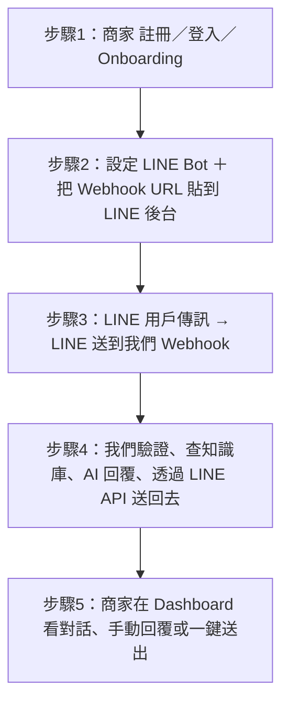

**Webhook 是啥？**

可以想成：**我們給 LINE 的「門牌地址」**。

- 平常是**我們**去問別人「有沒有新訊息」（叫「輪詢」）；那樣很慢、又浪費。
- **Webhook** 是反過來：我們先告訴 LINE：「有新訊息時，請你**主動**送到我這個網址。」  
  所以當有人在 LINE 傳訊息給商家時，LINE 會**自己**來「按我們家的門鈴」——也就是對我們的 **Webhook URL** 送一筆請求（POST）。我們的伺服器收到後就知道「有一則新訊息」，立刻去查知識庫、叫 AI、回覆給用戶。
- **Webhook URL** 就是那一串網址，例如：`https://www.customeraipro.com/api/webhook/line/某個Bot的ID/某把金鑰`。商家在 LINE 後台「設定 Webhook」時，就是把這串網址貼上去，LINE 以後就會把該 Bot 收到的訊息都送到這裡。

所以第 2 步裡「把我們的 Webhook URL 貼到 LINE 後台」的意思就是：**告訴 LINE：這個 Bot 的訊息請都送到我們家這個網址**。

---

**五步簡述**

1. 商家在我們網站註冊、登入、完成 onboarding。
2. 商家在 Dashboard 設定 LINE Bot（填 Channel Secret、Channel Access Token），並把我們的 **Webhook URL** 貼到 LINE 後台（也就是「告訴 LINE：有訊息就送到我們這個網址」）。
3. LINE 用戶在 LINE 傳訊息給商家 → LINE 平台把這則訊息「轉發」到我們的 Webhook URL。
4. 我們的後端：驗證是合法請求 → 找出對應的商家與設定 → 用用戶的訊息去搜尋該商家的知識庫 → 用 OpenAI 產生回覆 → 把回覆透過 LINE API 送回去。
5. 商家可以在 Dashboard 看所有對話、手動回覆、或把 AI 建議的草稿「一鍵送出」給客戶。

後面章節會把每一步拆開，用圖和簡單話講清楚。

### 3.4 小結

- CustomerAIPro = 接 LINE + AI + 知識庫的客服 SaaS。
- 三個角色：訪客/商家（網頁）、LINE 用戶（LINE App）、系統（我們的後端 + DB + OpenAI）。
- 核心就是：LINE 來訊 → 我們查知識庫 + AI 產生回覆 → 回傳 LINE；商家可在網頁上看與回覆。

---

## 第 4 章 整本書的地圖：我們會學哪些部分

### 4.1 為什麼要學「系統怎麼跑」？

就算你只有 10 歲，也可以先建立「大圖」：

- **除錯**：哪裡壞了？是前端沒送對、後端算錯、還是資料庫沒資料？
- **加功能**：新按鈕要接哪一個 API？資料要存到哪一張表？
- **跟別人溝通**：能說出「請求從瀏覽器到 API 再到資料庫」的順序，大家就能一起改同一套系統。

### 4.2 本書各 Part 對應的「層」

| Part | 主題 | 對應的「層」 |
|------|------|----------------|
| Part I | 什麼是 SaaS、系統在做什麼 | 概念 |
| Part II | 系統大圖、誰跟誰講話 | 整體流程 |
| Part III | 前端頁面與元件 | 前端 |
| Part IV | 後端 API | 後端 |
| Part V | 資料庫與 RLS | 資料庫 |
| Part VI | AI 與知識庫 | 後端 + 外部服務（OpenAI） |
| Part VII | 安全、部署、監控 | 全系統 |
| Part VIII | 完整流程串起來 | 整合 |

### 4.3 小結

- 本書從「概念 → 大圖 → 前端 → 後端 → 資料庫 → AI → 安全與部署 → 完整流程」一路講下來。
- 每一章都會用簡單的話和圖表，讓你之後看程式碼時知道「這段是在哪一層、在幹嘛」。

---

# Part II：系統大圖—誰在跟誰講話？

---

## 第 5 章 三種「人」：訪客、登入的商家、LINE 用戶

### 5.1 訪客（未登入）

- 可以看：首頁、定價、登入頁、條款、隱私、Help 文章。
- **不能**進 Dashboard、設定、對話、帳單。若直接打 Dashboard 網址，會被 **proxy** 轉到登入頁。

### 5.2 登入的商家

- 用 **Supabase Auth** 登入（email/密碼 或 LINE OAuth）。
- 登入後若還沒完成 **onboarding**（填店名、產業等），會被導向 onboarding 頁；完成後才能進 Dashboard。
- 可以：看儀表板、設定 Bot、管理知識庫、看對話與聯絡人、看分析、帳單、一鍵送出 AI 建議、手動回覆 LINE 客戶。

### 5.3 LINE 用戶

- 不登入我們的網站。他們只在 **LINE** 裡跟商家的官方帳號聊天。
- 他們傳的訊息由 **LINE 平台** 送到我們的 **Webhook**；我們回覆時是透過 **LINE API** 把訊息推回給該 LINE 用戶。

### 5.4 一張表：誰能碰什麼

| 誰 | 我們的網站（前端） | 我們的 API（後端） | LINE |
|----|--------------------|--------------------|------|
| 訪客 | 只能看公開頁 | 大部分 API 會回 401 未授權 | — |
| 登入商家 | 可進 Dashboard、設定、對話 | 帶 Cookie/Bearer，可呼叫需登入的 API | 不直接；透過我們回覆他的客戶 |
| LINE 用戶 | 不來我們網站 | 只有 Webhook 是「公開」的（用 botId + webhookKey 驗證） | 傳訊、收訊 |

### 5.5 小結

- 三種人：訪客、登入商家、LINE 用戶。
- 權限由 **proxy（網頁）** 和 **API 的認證** 控制；Webhook 用 botId + webhookKey，不用網站登入。

---

## 第 6 章 請求與回應：瀏覽器、API、資料庫的三角關係

### 6.1 一次「點擊」背後發生什麼

當你在 Dashboard 點「對話」：

1. **瀏覽器（前端）** 發送一個 **HTTP 請求** 到我們的網址，例如：  
   `GET https://www.customeraipro.com/api/conversations/counts`  
   並且帶上 **Cookie**（裡面有登入憑證）。
2. **後端** 收到請求後：
   - 檢查 Cookie → 確認是某個已登入使用者。
   - 用這個使用者的 id 去 **資料庫** 查「這個人的對話數量」。
   - 把結果包成 **JSON** 回傳給瀏覽器。
3. **前端** 收到 JSON，把數字顯示在畫面上（例如「未處理 5」）。

### 6.2 請求與回應長什麼樣（概念）

- **請求**：方法（GET/POST/PUT/DELETE）、網址路徑、標頭（Header，例如 Cookie、Content-Type）、有時有 body（例如 POST 的 JSON）。
- **回應**：狀態碼（200 成功、401 未授權、404 找不到、500 伺服器錯誤）、body 常常是 JSON（例如 `{ "total": 5 }`）。

### 6.3 三角關係圖

```
    瀏覽器                    後端 API                    資料庫
       │                         │                          │
       │  GET /api/xxx + Cookie   │                          │
       │ ───────────────────────►│                          │
       │                         │  SELECT ... WHERE user_id=?
       │                         │ ─────────────────────────►
       │                         │                          │
       │                         │ ◄─────────────────────────
       │                         │  { rows }                 │
       │  { "data": ... }        │                          │
       │ ◄───────────────────────│                          │
```

### 6.4 小結

- 前端發 **HTTP 請求**（帶 Cookie 或 Token）→ 後端驗證並查資料庫 → 回傳 **JSON** → 前端顯示。
- 這就是「請求與回應」的三角關係；本書後面講的每個 API 都是這個模式。

---

## 第 7 章 一張圖看懂「從 LINE 發訊到收到 AI 回覆」

### 7.1 流程概覽

```
LINE 用戶                 LINE 平台                我們的系統                    資料庫 / OpenAI
    │                        │                         │                              │
    │  傳送文字訊息            │                         │                              │
    │ ──────────────────────►│                         │                              │
    │                        │  POST /api/webhook/line/[botId]/[webhookKey]            │
    │                        │ ───────────────────────►│                              │
    │                        │                         │  驗簽、查 bot、解密            │
    │                        │                         │  寫入 webhook_events (pending)  │
    │                        │                         │ ─────────────────────────────►
    │                        │                         │  冪等檢查、限流               │
    │                        │                         │  取得/建立 contact、設定      │
    │                        │                         │  搜尋知識庫                   │
    │                        │                         │ ─────────────────────────────►
    │                        │                         │  決策：AUTO/SUGGEST/ASK/HANDOFF
    │                        │                         │  若 AUTO：呼叫 OpenAI         │
    │                        │                         │ ─────────────────────────────►
    │                        │                         │  回覆內容                     │
    │                        │                         │  寫入 conversations、更新     │
    │                        │                         │  webhook_events (processed)   │
    │                        │                         │  推播回 LINE (pushMessage)     │
    │                        │                         │ ───────────────────────►     │
    │                        │ ◄───────────────────────│                              │
    │ ◄──────────────────────│  訊息送達用戶            │                              │
```

### 7.2 步驟簡述

1. **LINE 用戶** 在 LINE 傳訊息給商家的官方帳號。
2. **LINE 平台** 把事件 POST 到我們的 Webhook URL（帶簽章）。
3. **我們**：驗簽、用 botId + webhookKey 找到對應的 Bot 與商家、解密 Channel Token、把事件存進 `webhook_events`、做冪等與限流、取得或建立 `contact`、載入商家設定、搜尋知識庫、走決策層（AUTO/SUGGEST/ASK/HANDOFF）。
4. 若是 **AUTO**：用 OpenAI 產生回覆、寫入 `conversations`、用 LINE API **pushMessage** 把回覆送給該 LINE 用戶、把 `webhook_events` 標成 processed。
5. **LINE 用戶** 在 LINE 裡看到回覆。

### 7.3 小結

- 從 LINE 發訊到收到 AI 回覆：LINE → 我們 Webhook → 驗證、存事件、查知識庫、決策、OpenAI、存對話、推回 LINE。
- 這條路徑是「無前端」的：完全是後端 + 資料庫 + OpenAI + LINE API。

---

## 第 8 章 多語系與網址：zh-TW、en 與路由

### 8.1 我們支援的語言

- **zh-TW**：繁體中文（預設）。
- **en**：英文。
- 網址裡會帶語言，例如：`/zh-TW/dashboard`、`/en/pricing`。

### 8.2 路由長什麼樣

- 公開頁：`/[locale]/`、`/[locale]/login`、`/[locale]/pricing`…
- Dashboard：`/[locale]/dashboard`、`/[locale]/dashboard/conversations`、`/[locale]/dashboard/settings/bots`…
- API **沒有** locale：API 路徑是 `/api/xxx`，不帶 zh-TW/en；語言由前端或 Accept-Language 決定。

### 8.3 誰決定「現在是哪一種語言」

- **next-intl** 會根據網址的 `[locale]` 或設定，決定要顯示哪一份翻譯。
- 翻譯文案放在 `messages/zh-TW.json`、`messages/en.json`；元件用 `useTranslations()` 取字串。
- **proxy** 在導向登入頁時會盡量保留或推測 locale（例如 `/zh-TW/login`）。

### 8.4 小結

- 多語系用 **next-intl**，網址帶 `[locale]`（zh-TW / en）。
- API 路徑不含 locale；前後端都要記得「語言」只影響顯示，不影響後端邏輯。

---

# Part III：前端—使用者看到的網頁

---

## 第 9 章 Next.js 與「一個網址對應一個頁面」

### 9.1 什麼是 Next.js

Next.js 是一個 **React 框架**。要懂這句話，先要知道 **React 是啥**。

**React 是啥？**

React 是一個用來「畫網頁畫面」的 **JavaScript 程式庫**（library）。

- 一般網頁是用 HTML 一塊一塊寫死：這裡一個按鈕、那裡一張表。要改一個數字或重複一塊區塊，就要複製貼上、容易出錯。
- **React** 的作法不一樣：你把畫面拆成很多小塊，每一塊是一個 **元件**（component），例如「一個按鈕」「一張統計卡」「一整塊表單」。每個元件可以**接收資料**（叫 props），然後根據資料**自己畫出對應的 HTML**。資料一變，React 會自動幫你**只更新有變的那一塊**，不用整頁重畫。
- 所以「用 React 畫畫面」= 用很多可重用的小元件＋資料，組出整頁；寫法通常是 **JSX**（在 JavaScript 裡寫長得很像 HTML 的語法），編譯後變成瀏覽器真的能跑的網頁。

**那 Next.js 呢？**

Next.js 是 **建在 React 上面的框架**：除了「用 React 畫畫面」之外，還幫你管好「**網址對應哪一個頁面**」、「**哪些在伺服器先算好（SSR）**」、「**API 路由放在哪裡**」。我們用的是 **App Router**（Next.js 13+）：**檔案夾結構就是路由結構**（哪個資料夾、哪個檔名，就對應哪個網址）。

### 9.2 我們的頁面結構（簡化）

```
app/
  [locale]/           ← 動態：zh-TW 或 en
    page.tsx           → 首頁 /
    login/page.tsx     → /login
    pricing/page.tsx   → /pricing
    dashboard/
      page.tsx         → /dashboard
      conversations/page.tsx        → /dashboard/conversations
      conversations/[contactId]/page.tsx  → /dashboard/conversations/某個 id
      knowledge-base/page.tsx       → /dashboard/knowledge-base
      settings/
        page.tsx       → /dashboard/settings
        bots/page.tsx   → /dashboard/settings/bots
    help/
      [category]/[article]/page.tsx  → /help/某分類/某文章
  api/                 ← 後端 API 路由（下一 Part 講）
```

### 9.3 一個頁面檔案在做什麼

- 每個 `page.tsx` 是一個 **React 元件**，負責「這一頁」要顯示什麼。
- 它可能從 API 拿資料（用 `fetch` 或 SWR 等），然後用 JSX 畫出按鈕、表格、圖表。
- 需要登入的頁（例如 dashboard）不會自己檢查登入；**proxy（middleware）** 會先檢查，沒登入就導向登入頁。

### 9.4 小結

- Next.js App Router：資料夾 = 路由；`page.tsx` = 該路由的頁面。
- 我們用 `[locale]` 包一層，所以所有頁面都有「語言」維度。

---

## 第 10 章 首頁、登入頁、定價頁：公開頁面

### 10.1 首頁（/）

- 檔案：`app/[locale]/page.tsx`。
- 給還沒登入的人看：產品介紹、CTA（例如「開始使用」）、可能導向登入或註冊。
- 不呼叫需要登入的 API。

### 10.2 登入頁（/login）

- 檔案：`app/[locale]/login/page.tsx`。
- 提供：email + 密碼（Supabase Auth），或「用 LINE 登入」按鈕（導向 `/api/auth/line`）。
- 登入成功後，Supabase 會設定 Cookie；proxy 之後就會放行進 Dashboard。
- 若使用者還沒完成 onboarding，會被導到 `/dashboard/onboarding`。

### 10.3 定價頁（/pricing）

- 檔案：`app/[locale]/pricing/page.tsx`。
- 顯示方案與價格（Free / Starter / Pro / Business），通常只讀、不呼叫需登入的 API；方案限制來自 `lib/plans.ts`。

### 10.4 其他公開頁

- **條款**、**隱私**、**Help**、**Support**、**Demo** 等：都是 `app/[locale]/xxx/page.tsx`，訪客可看，不強制登入。

### 10.5 小結

- 公開頁：首頁、登入、定價、條款、隱私、Help 等；誰都能看。
- 登入流程用 Supabase Auth；登入後由 proxy 導向 onboarding 或 Dashboard。

---

## 第 11 章 Dashboard：登入後才能進的區域

### 11.1 什麼是 Dashboard

Dashboard 就是「商家登入後的工作台」：總覽、對話、聯絡人、知識庫、分析、帳單、設定、Bot 管理、系統檢測等，都在這裡。

### 11.2 主要子頁面（對應路徑與功能）

| 路徑 | 功能 |
|------|------|
| `/dashboard` | 儀表板首頁：總覽數字、圖表、快捷入口 |
| `/dashboard/onboarding` | 新手引導：填店名、產業等，完成後才能用其他 Dashboard 頁 |
| `/dashboard/conversations` | 對話列表：依聯絡人、狀態篩選 |
| `/dashboard/conversations/[contactId]` | 單一聯絡人的對話詳情：訊息列表、AI 建議草稿、一鍵送出、手動回覆 |
| `/dashboard/contacts` | 聯絡人列表、標籤 |
| `/dashboard/knowledge-base` | 知識庫：新增/編輯/刪除、匯入、搜尋、測試 AI、Gap 分析 |
| `/dashboard/analytics` | 分析：總覽、趨勢、解決率、熱門問題等 |
| `/dashboard/billing` | 帳單與使用量 |
| `/dashboard/settings` | 一般設定（系統提示、AI 模型等） |
| `/dashboard/settings/bots` | LINE Bot 列表、新增/編輯 Bot、Webhook URL、測試連線 |
| `/dashboard/ai-quality` | AI 品質相關 |
| `/dashboard/system-test` | 系統檢測：健康檢查、功能開關 |

### 11.3 權限怎麼控

- **proxy** 會檢查：網址是 `/dashboard` 或 `/settings` 時，若沒有登入（Supabase 沒有 user），就 **redirect** 到 `/[locale]/login`。
- 若已登入但 `users.onboarding_completed` 不是 true，就 redirect 到 `/[locale]/dashboard/onboarding`。
- 所以「能進 Dashboard」= 已登入 + 已完成 onboarding。

### 11.4 小結

- Dashboard 是登入後的全部功能區；每個子路徑對應一個或一組頁面。
- 權限由 proxy 統一控：未登入 → 登入頁；未完成 onboarding → onboarding 頁。

---

## 第 12 章 元件就像積木：按鈕、表格、圖表

### 12.1 什麼是元件（Component）

在 React 裡，一個「元件」就是一小塊可重複使用的 UI：例如一個按鈕、一張統計卡、一個對話泡泡。我們把很多小元件組起來，變成整頁。

### 12.2 我們專案裡常見的元件

- **共用**：`Toast`（提示訊息）、`EmptyState`（沒資料時的畫面）、`LocaleSwitcher`（切語言）、`GlobalSearch`。
- **Dashboard 共用**：`StatCard`（數字卡）、`StatusBadge`（狀態標籤）、`TrendChart`（趨勢圖）、`ErrorCollapse`（錯誤摺疊）。
- **Landing**：`LandingNavbar`、`LandingFooter`、`LandingFAQ`。
- **對話**：對話列表、篩選、訊息氣泡、建議草稿區、一鍵送出按鈕等（在 `dashboard/conversations` 底下或 components 裡）。
- **知識庫**：列表、搜尋、新增/編輯 Modal、匯入、TestPanel、GapAnalysis 等。

### 12.3 元件與 API 的關係

- 頁面（或大元件）負責「呼叫哪一個 API」、「什麼時候重新整理」。
- 小元件通常只負責「顯示」：接收 `props`（資料 + 回呼函式），不直接管 API 網址；這樣比較好測試、好維護。

### 12.4 小結

- 前端由一層層 React 元件組成；元件像積木，可重用。
- 我們有共用元件（Toast、StatCard、EmptyState…）和功能專用元件（對話、知識庫、設定…）。

---

## 第 13 章 多語系（i18n）：同一頁面顯示不同語言

### 13.1 什麼是 i18n

i18n = internationalization（國際化）：同一套介面，依「語言設定」顯示不同文字。我們用 **next-intl** 做這件事。

### 13.2 文案存在哪裡

- `messages/zh-TW.json`：繁體中文的 key-value。
- `messages/en.json`：英文的 key-value。
- 元件裡用 `useTranslations('某個 namespace')` 取得 `t('key')`，就會依目前 locale 顯示對應字串。

### 13.3 路由與 locale

- 網址的 `[locale]` 決定現在是 zh-TW 還是 en；next-intl 的 middleware（在 proxy 之前/之後）會處理「沒帶 locale 時導到預設語系」。
- 所以同一頁「程式碼只有一份」，只是讀取的翻譯不同。

### 13.4 小結

- 多語系用 next-intl；文案在 `messages/*.json`，元件用 `useTranslations`。
- 網址帶 locale；API 不帶 locale，後端邏輯與語言無關（除必要時可讀 Accept-Language）。

---

## 第 14 章 前端如何呼叫後端 API

### 14.1 基本方式：fetch

前端用瀏覽器內建的 `fetch(網址, { method, headers, body })` 呼叫我們的 API。例如：

- `GET /api/conversations/counts`：拿對話計數，要帶 Cookie（登入後瀏覽器會自動帶）。
- `POST /api/chat`：body 裡放 `{ message: "使用者輸入的文字" }`，回傳 `{ content: "AI 回覆" }`。

### 14.2 認證怎麼帶

- **Cookie**：登入後 Supabase 會設 Cookie；同網域下 `fetch` 會自動帶上，後端用 Supabase 的 `getUser()` 就能辨識是誰。
- **Bearer Token**：若前端手動帶（例如某些整合），就在 Header 裡放 `Authorization: Bearer <token>`；後端同樣用 Supabase 驗證。

### 14.3 錯誤處理

- API 回 4xx/5xx 時，前端應檢查 `response.ok` 或 `response.status`，並顯示錯誤訊息（例如用 Toast）；常見 401 → 導向登入、402 → 方案上限提示。

### 14.4 小結

- 前端用 `fetch` 呼叫 `/api/xxx`，登入後 Cookie 自動帶上；必要時可帶 Bearer。
- 要處理錯誤狀態與使用者提示。

---

# Part IV：後端 API—網站的大腦與雙手

---

## 第 15 章 API 是什麼？用「點餐」來比喻

### 15.1 比喻

- **你（前端）**：跟櫃台說「我要一杯紅茶」。
- **櫃台（API）**：聽懂你的請求、去廚房（資料庫 / 外部服務）拿結果、把紅茶（回應）給你。
- **方法**：GET = 查詢、POST = 新增/執行、PUT/PATCH = 更新、DELETE = 刪除。

### 15.2 我們的 API 長什麼樣

- 每個 API 對應 `app/api/` 底下的一個「路徑」；一個路徑可能有一個 `route.ts`，裡面 export `GET`、`POST`、`PUT`、`DELETE` 等函式。
- 回傳統一用 `NextResponse.json({ ... })`；錯誤時回傳 `NextResponse.json({ error: "..." }, { status: 4xx或5xx })`。

### 15.3 哪些 API 是「公開」的（不用登入）

- `/api/webhook/line/...`：LINE 平台呼叫，用 botId + webhookKey 驗證。
- `/api/health`、`/api/health-check`、`/api/health/...`：健康檢查。
- `/api/auth/line`、`/api/auth/line/callback`：登入流程。
- 其餘需要登入的 API，在 **proxy** 裡會先檢查 user；沒有 user 就回 401。

### 15.4 小結

- API = 後端提供的「介面」；前端用 HTTP 方法 + 路徑 + body/headers 呼叫。
- 我們用 Next.js App Router 的 `route.ts` 實作；公開 API 只有 webhook、health、auth。

---

## 第 16 章 認證：誰可以進來？Cookie、Bearer、Supabase Auth

### 16.1 登入後「身分」存在哪裡

- 我們用 **Supabase Auth**：使用者用 email/密碼 或 LINE OAuth 登入後，Supabase 會發 **session**，存在 **Cookie** 裡（或你選的 storage）。
- 之後每個請求，瀏覽器都會帶這個 Cookie；後端用 `createClient()`（從 cookie 讀）＋ `getUser()` 就能得到 `user.id`（即 `auth.users.id`），對應我們 `public.users.id`。

### 16.2 Cookie vs Bearer

- **Cookie**：給瀏覽器用；同網域請求自動帶上，適合「網頁登入」。
- **Bearer Token**：放在 Header `Authorization: Bearer <token>`，適合 API 客戶端、手機 App、或前後端分離時前端手動帶 token。
- 我們後端兩種都支援（Supabase client 可從 cookie 或 token 還原 user）。

### 16.3 後端怎麼「知道是誰」

- 在 API route 裡：`const supabase = await createClient();` 然後 `const { data: { user } } = await supabase.auth.getUser();`。
- 若 `user` 為 null → 未登入；可回 401。
- 若 `user` 存在 → `user.id` 就是這個請求的身分，之後查資料都用「WHERE user_id = user.id」或透過 RLS 自動過濾。

### 16.4 小結

- 認證用 Supabase Auth；身分存在 Cookie（或 Bearer token）。
- 後端用 `getUser()` 取得當前使用者；沒 user 就 401；有 user 就用 `user.id` 做權限與資料範圍。

---

## 第 17 章 proxy.ts：守門員（檢查登入、導向登入頁）

### 17.1 為什麼需要「守門員」

- 若每個頁面、每個 API 都自己寫「有沒有登入」，會重複且容易漏。所以我們用一個 **proxy**（Next.js 16 的 middleware 概念，我們專案裡是 `proxy.ts`）在請求「進到頁面或 API 之前」先檢查。

### 17.2 proxy 做了什麼（簡化）

1. **API 請求**：
   - 若是公開路徑（`/api/webhook/`、`/api/health`、`/api/auth/`）→ 直接放行。
   - 否則：取得 Supabase user；沒有 user → 回 **401 JSON**；有 user → 放行。
2. **頁面請求**：
   - 若是 dashboard 或 settings 路徑：沒有 user → **redirect** 到 `/[locale]/login`。
   - 若有 user 且是 dashboard 但還沒完成 onboarding → redirect 到 `/[locale]/dashboard/onboarding`。
   - 其他：交給 next-intl 做語系處理，並加上 **安全標頭**（X-Frame-Options、CSP 等）。

### 17.3 安全標頭

- proxy 會在回應上加上：X-Frame-Options、X-Content-Type-Options、Referrer-Policy、CSP、production 時 HSTS 等，避免被嵌框、MIME  sniffing 等問題。

### 17.4 小結

- proxy 是統一守門員：API 未登入且非公開 → 401；Dashboard/Settings 未登入 → 導向登入；未完成 onboarding → 導向 onboarding。
- 同時加上安全標頭。

---

## 第 18 章 設定 API：讀寫使用者的系統提示、LINE 設定

### 18.1 GET/POST /api/settings

- **GET**：回傳當前使用者的設定（例如 `system_prompt`、`ai_model`、其他偏好）。從 `users` 表或延伸的設定表讀取，RLS 保證只讀得到自己的。
- **POST**：更新設定（body 裡帶要改的欄位）；後端驗證後寫入 DB。

### 18.2 GET/PUT /api/settings/line、POST /api/settings/line/test

- LINE Channel 的設定（可能存於 `users` 或專用表）：Channel ID、Secret、Access Token 等。
- **test**：用目前設定呼叫 LINE API 驗證連線是否成功。

### 18.3 GET/POST /api/settings/bots、PUT /api/settings/bots/[id]

- **多 Bot** 時：列出該使用者的所有 Bot、新增 Bot、更新 Bot（含重新產生 webhook key）。
- Bot 資料存 `line_bots` 表；憑證用加密存（見第 37 章）。

### 18.4 小結

- 設定類 API 負責「讀寫當前使用者的設定」與「LINE/Bot 設定」；一律需登入，RLS 限制只看自己的資料。

---

## 第 19 章 知識庫 API：新增、搜尋、測試 AI 回答

### 19.1 GET/POST /api/knowledge-base

- **GET**：列出該使用者的知識庫條目（分頁、篩選）；從 `knowledge_base` 表讀，`user_id = 當前 user`。
- **POST**：新增一筆（title、content、category 等）；會檢查方案上限（知識庫條數）。

### 19.2 GET/PUT/DELETE /api/knowledge-base/[id]

- 單筆的查詢、更新、刪除；RLS 確保只能動自己的。

### 19.3 POST /api/knowledge-base/import、import-url

- 批次匯入（TXT/CSV）或從 URL 抓內容匯入；同樣受方案條數上限限制。

### 19.4 GET /api/knowledge-base/search、POST /api/knowledge-base/test

- **search**：依關鍵字搜尋知識庫（給列表/篩選用）。
- **test**：給一段「問題」文字，後端用和聊天一樣的流程（知識庫搜尋 + OpenAI）產生一回覆，回傳給前端顯示；用來預覽「客戶問這題時 AI 會怎麼答」。

### 19.5 GET /api/knowledge-base/stats、gap-analysis

- **stats**：該使用者知識庫的統計（條數、分類分布等）。
- **gap-analysis**：分析「常見問題或對話」裡有哪些還沒被知識庫涵蓋，供補強用。

### 19.6 小結

- 知識庫 API 涵蓋 CRUD、匯入、搜尋、測試回答、統計與 Gap 分析；都依 `user_id` 隔離，並受方案限制。

---

## 第 20 章 聊天 API（/api/chat）：儀表板內建測試

### 20.1 用途

- 讓**已登入的商家**在 Dashboard 裡「試打一句話」，看 AI 會回什麼；不經過 LINE，純粹測試系統提示 + 知識庫 + OpenAI。

### 20.2 流程（簡化）

1. 前端 POST `/api/chat`，body：`{ message: "使用者輸入" }`。
2. 後端：驗證登入 → 敏感詞檢查 → 檢查本月對話使用量（方案上限）→ 讀取該使用者的 `system_prompt`、`ai_model` → 用 `searchKnowledgeForUser` 搜尋知識庫 → 組系統提示（含知識庫內容）→ 呼叫 `generateReply`（OpenAI）→ 回傳 `{ content: "AI 回覆" }`。
3. 前端把 `content` 顯示在畫面上。

### 20.3 與 LINE Webhook 的差異

- **/api/chat**：登入者、單次請求、不寫 conversations、不推 LINE；只用來「測試」。
- **Webhook**：LINE 平台觸發、會寫 conversations、會推回 LINE、會走完整決策層（AUTO/SUGGEST/ASK/HANDOFF）與建議草稿。

### 20.4 小結

- `/api/chat` 是儀表板內建的一鍵測試；流程與實際回覆類似，但不寫對話、不發 LINE。

---

## 第 21 章 LINE Webhook API：接收 LINE 平台送來的事件

### 21.1 Webhook 是什麼

- LINE 平台在「有人傳訊息、加入好友……」時，會主動 **POST** 一筆 JSON 到我們事先填好的 URL，這就是 **Webhook**。我們「被動接收」，不用輪詢。

### 21.2 URL 長什麼樣

- 單一 Bot（舊）：`POST /api/webhook/line`。
- **多 Bot**：`POST /api/webhook/line/[botId]/[webhookKey]`。每個 Bot 一組 URL；商家在 LINE Developers 後台貼上這組 URL。

### 21.3 我們後端做了什麼（多 Bot 版）

1. 從網址取得 `botId`、`webhookKey`。
2. 查 `line_bots`：是否存在、是否啟用、`webhook_key_hash` 是否與傳入的 key 相符。
3. 解密 Bot 的 `encrypted_channel_secret`、`encrypted_channel_access_token`。
4. 讀取 body、驗證 **x-line-signature**（簽章），確認是 LINE 送來的。
5. 把原始 body 寫入 `webhook_events`（status = pending）。
6. 若 production 且沒有 Redis，可標失敗並回 200（避免 LINE 重試爆掉）。
7. 冪等檢查（Redis）：同一事件不處理兩次；限流。
8. 解析 body 裡的 `events`，逐個呼叫 `handleEvent`（與單 Bot 共用邏輯）：getOrCreateContact、載入設定、可選觸發 workflow、否則搜尋知識庫、決策層、OpenAI、寫 conversations、推回 LINE、寫 ai_suggestions（若是 SUGGEST）。
9. 把 `webhook_events` 更新為 processed（或 failed）；冪等標記寫回 Redis。
10. 回傳 200 給 LINE（LINE 要求快速 200，實際處理可非同步）。

### 21.4 小結

- Webhook 是 LINE 主動 POST 到我們；我們用 botId + webhookKey 認 Bot、驗簽、存事件、冪等與限流、處理事件、回覆 LINE。

---

## 第 22 章 聯絡人與對話 API：列表、標籤、建議草稿

### 22.1 聯絡人

- **GET /api/contacts**：列表（該使用者的 contacts）。
- **GET /api/contacts/[id]**：單一聯絡人詳情。
- **GET/POST /api/contacts/tags**、**PATCH/DELETE /api/contacts/tags/[id]**：標籤的 CRUD。
- **POST /api/contacts/[id]/tags**、**DELETE /api/contacts/[id]/tags/[tagId]**：把標籤貼到聯絡人上或移除。

### 22.2 對話

- **GET /api/conversations/counts**：各狀態的對話數量（例如未處理、已解決）。
- **GET /api/conversations/[id]/status**、**PATCH**：查詢或更新對話狀態。
- **GET /api/conversations/[id]/suggestions**、**POST /api/conversations/[id]/suggestions**：AI 建議草稿的讀取與新增。
- **POST /api/suggestions/[id]/send**：把一則建議草稿「一鍵送出」給 LINE 客戶（呼叫 LINE pushMessage、更新 ai_suggestions 為 sent）。
- **POST /api/conversations/[id]/reply**：手動回覆一則訊息（內容由 body 傳入，後端轉送 LINE）。
- **POST /api/conversations/[id]/handback**、**takeover**：轉人工/接管的狀態更新。

### 22.3 小結

- 聯絡人與對話 API 支援列表、標籤、狀態、建議草稿與一鍵送出、手動回覆；都依登入者與 RLS 隔離。

---

## 第 23 章 分析與帳單 API

### 23.1 分析

- **GET /api/analytics/overview**：總覽數字。
- **GET /api/analytics/trends**、**resolution**、**hourly**、**top-contacts**、**top-questions**、**quality**、**export** 等：各種維度的統計與匯出。
- 資料來源是 conversations、contacts、可能還有 ai_feedback；後端依 user_id 彙總，前端畫成圖表。

### 23.2 帳單與使用量

- **GET /api/billing/usage**：本月使用量（對話數、知識庫條數）與方案上限。
- **GET /api/usage**、**/api/subscription**、**/api/payments**：使用情況、訂閱狀態、付款記錄。
- 方案限制定義在 `lib/plans.ts`（Free/Starter/Pro/Business 的 monthly_conversations、knowledge_entries）。

### 23.3 小結

- 分析與帳單 API 提供儀表板所需的數字與歷史；使用量與方案限制由 plans 與 DB 一起實作。

---

## 第 24 章 健康檢查 API：系統有沒有活著

### 24.1 用途

- 讓監控系統或人確認：網站還在跑、Supabase 連得到、OpenAI 連得到、rate limit / 敏感詞 / handoff 功能是否正常。
- 路徑例如：`/api/health-check`（彙總）、`/api/health/supabase`、`/api/health/openai`、`/api/health/security/rate-limit`、`/api/health/security/sensitive`、`/api/health/feature/handoff`、`/api/health/i18n`。
- 這些是 **公開 API**（proxy 放行），不回敏感資料，只回 ok/status。

### 24.2 小結

- 健康檢查 API 用於監控與除錯；全部不需登入，回傳簡短狀態。

---

# Part V：資料庫—資料存在哪裡、誰能看

---

## 第 25 章 關聯式資料庫與「表」

### 25.1 什麼是「表」（Table）

- 資料庫像很多張 **表格**：每一「列」是一筆資料，每一「欄」是一個屬性。例如 `users` 表：每一列是一個使用者，欄位有 id、email、created_at、onboarding_completed 等。

### 25.2 關聯式

- 表與表之間用 **外鍵（Foreign Key）** 連起來。例如 `contacts` 表有一欄 `user_id` 指向 `users.id`，表示「這個聯絡人屬於哪個使用者」；`conversations` 有 `contact_id` 指向 `contacts.id`，表示「這則對話屬於哪個聯絡人」。
- 這樣可以「查某使用者的所有聯絡人」、「某聯絡人的所有對話」，而不會混到別人的資料。

### 25.3 我們用誰當資料庫

- **Supabase**：提供 PostgreSQL 資料庫 + Auth + RLS（Row Level Security）。我們的所有業務表都在 Supabase 的 PostgreSQL 裡。

### 25.4 小結

- 關聯式資料庫用「表」與「外鍵」組織資料；我們用 Supabase（PostgreSQL）。

---

## 第 26 章 核心表：users、contacts、conversations

### 26.1 users

- 對應「登入的商家」。`id` 通常等於 `auth.users.id`（Supabase Auth 的使用者 id）；其他欄位如 email、system_prompt、ai_model、onboarding_completed 等。
- 一個 user 底下會有很多 contacts、很多知識庫條目、很多 line_bots。

### 26.2 contacts

- 代表「和商家對話的對象」；在 LINE 情境下通常是「一個 LINE 用戶」。欄位有 user_id（屬於哪個商家）、line_user_id（LINE 的 userId）、display_name、可能還有 avatar、tags 關聯等。
- 同一 LINE 用戶在不同 Bot 下可能對應不同 contact（依實作）；通常以 user_id + line_user_id 或 bot 維度區分。

### 26.3 conversations

- 代表「一則對話」或「一串訊息」。欄位有 contact_id（誰的對話）、可能 status（open/resolved）、resolved_by、created_at、updated_at 等。
- 對話裡的「單則訊息」可能存同一表（type 區分）或另表（messages）；我們專案裡 conversation 與訊息的結構以實際 migration 為準。
- 透過 contact_id → contact.user_id，可知這則對話屬於哪個商家，RLS 用這個來隔離。

### 26.4 關係圖（概念）

```
users (商家)
  │
  ├── contacts (聯絡人，例如 LINE 用戶)
  │     │
  │     └── conversations (對話)
  │
  ├── knowledge_base (知識庫條目)
  ├── line_bots (LINE Bot 設定)
  └── ...
```

### 26.5 小結

- users = 商家；contacts = 其聯絡人（如 LINE 用戶）；conversations = 聯絡人的對話；用 user_id 串起來做權限隔離。

---

## 第 27 章 知識庫表、標籤表、訂閱與付款表

### 27.1 knowledge_base

- 欄位：id、user_id、title、content、category、is_active、created_at 等。每個條目屬於一個 user；搜尋時用 user_id + 關鍵字過濾。

### 27.2 contact_tags、contact_tag_assignments

- **contact_tags**：標籤定義（name、user_id）。
- **contact_tag_assignments**：哪個 contact 貼了哪個 tag（contact_id、tag_id）。多對多關係。

### 27.3 plans、subscriptions、payments

- **plans**：方案定義（name、slug、限制等）。
- **subscriptions**：使用者訂閱哪個方案、到期日等（user_id → plan）。
- **payments**：付款記錄（user_id、金額、時間、狀態等）。
- 使用量（本月對話數）可由 conversations 或專用計數表統計，與 `lib/plans.ts` 的上限比對。

### 27.4 其他表（簡列）

- **line_bots**：Bot id、user_id、webhook_key_hash、加密後的 channel secret/token、is_active。
- **webhook_events**：bot_id、raw_body、status（pending/processed/failed）、processed_at、error_message。
- **ai_suggestions**：contact_id、conversation 相關、suggested_reply、status（draft/sent）、sent_at、bot_id、event_id。
- **workflows**、**workflow_logs**：自動化流程定義與執行紀錄。
- **campaigns**、**campaign_logs**：行銷活動與發送紀錄。
- **ai_feedback**、**ai_guidance_rules**、**ab_tests** 等：AI 品質、規則、A/B 測試。

### 27.5 小結

- 知識庫、標籤、訂閱與付款、Bot、Webhook 事件、AI 建議、工作流程、Campaign 等都有對應表；多數都帶 user_id 或經 contact 連到 user_id，供 RLS 隔離。

---

## 第 28 章 RLS：同一張表，每人只看得到自己的資料

### 28.1 什麼是 RLS

- **Row Level Security** = 列層級安全。在 PostgreSQL 裡，可以對一張表設定「原則」：只有符合條件的列才能被查詢、插入、更新、刪除。
- 我們的原則通常是：`auth.uid() = user_id` 或「該列的 user_id 等於當前登入使用者的 id」。這樣即使用戶 A 知道用戶 B 的某筆 id，也無法在 API 裡查到或改到 B 的資料（因為 RLS 會過濾掉）。

### 28.2 誰來執行 RLS

- 當 API 用「一般 Supabase client」（帶使用者 Cookie/Token）查資料時，用的是該使用者的權限；RLS 會自動套用。
- 當我們用 **service_role** 或 **admin** client（例如 webhook、批次 job）時，可以繞過 RLS，所以後端程式必須自己保證「只查/改該 Bot 對應的 user 的資料」。

### 28.3 小結

- RLS 讓同一張表「每人只看得到自己的列」；我們 20 張表都啟用 RLS；admin 操作時要自己帶入正確的 user 範圍。

---

## 第 29 章 Migration：資料庫結構的「版本控制」

### 29.1 什麼是 Migration

- 資料庫的「結構」（有哪些表、欄位、索引、RLS）用 **SQL 腳本** 記錄下來，按順序執行；每個腳本就是一個 **migration**。例如 `001_phase1_schema.sql`、`008_create_knowledge_base.sql`、`029_multibot_copilot.sql`。
- 這樣團隊可以一起升級資料庫，不會漏改或改錯順序。

### 29.2 我們專案

- 所有 migration 放在 `supabase/migrations/`；依編號執行；Supabase 會記錄「已執行到哪一版」。
- 新增表或欄位時，寫新的 migration 檔，不要直接改舊的（避免已上線環境錯亂）。

### 29.3 小結

- Migration 是資料庫結構的版本控制；我們用 Supabase migrations 目錄，按序執行。

---

# Part VI：AI 與知識庫—機器怎麼「回答」人

---

## 第 30 章 一句話：AI 怎麼產生回覆（OpenAI + 系統提示 + 知識庫）

### 30.1 流程（一句話）

- **使用者訊息** + **系統提示（含知識庫搜尋結果）** → 送給 **OpenAI**（我們用 GPT-4o-mini）→ 得到 **回覆文字**。
- 系統提示裡會寫「你是客服、只根據以下知識庫回答、不要編造」等；知識庫內容是依使用者訊息關鍵字搜尋出來的幾條，拼進系統提示。

### 30.2 誰提供「系統提示」與「模型」

- 商家的 **users** 表（或設定表）裡有 `system_prompt`、`ai_model`；API 或 webhook 處理時會讀取該使用者的設定。
- 知識庫搜尋用 `searchKnowledgeForUser(userId, message, limit, maxChars)`（或 searchKnowledgeWithSources），得到一段文字 + sources，貼進 system prompt。

### 30.3 小結

- AI 回覆 = 使用者訊息 + 系統提示（含知識庫片段）+ OpenAI API；系統提示與模型來自該商家的設定。

---

## 第 31 章 知識庫搜尋：關鍵字、分詞、快取

### 31.1 目的

- 從該商家的 `knowledge_base` 裡，找出和「使用者這句訊息」最相關的幾條，組成一塊文字給 AI 當 context。
- 避免把整本知識庫都塞給 AI（會爆 token、也慢），所以用「搜尋」先篩選。

### 31.2 怎麼搜尋（概念）

- **分詞**：把使用者訊息拆成關鍵字（英文按空格、中文用 2～3 字 n-gram）；有做簡單同義正規化（例如退錢/退費→退款）。
- **查詢**：用關鍵字在 `title`、`content` 上做 ilike 或全文搜尋，篩出候選列；再依「命中關鍵字數量」打分，取前幾條。
- **長度限制**：組成一串文字時有 maxChars 上限（例如 2000），避免超過模型 context。
- **快取**：同一 user + 同一 message + 同一 limit/maxChars 的結果可快取幾分鐘（例如 5 分鐘），減少重複查 DB 與 OpenAI。

### 31.3 小結

- 知識庫搜尋 = 分詞 → 關鍵字查 DB → 評分取 top → 組字串（含長度限制）→ 可快取；供 /api/chat 與 webhook 共用。

---

## 第 32 章 決策層：AUTO / SUGGEST / ASK / HANDOFF

### 32.1 為什麼要「決策層」

- AI 不能什麼都自動回覆：例如退款、折扣、賠償，若資訊不足或風險高，應該「建議草稿給人審」或「先問清楚」或「轉人工」。所以我們有一層邏輯決定：這次要 **AUTO**（直接回）、**SUGGEST**（存草稿、回固定話術）、**ASK**（先問 1～3 題）、還是 **HANDOFF**（轉人工）。

### 32.2 四種結果

| 決策 | 意思 | 行為 |
|------|------|------|
| **AUTO** | 低風險、有知識庫依據、信心夠 | 呼叫 OpenAI 產生回覆、過 guardrail、送給客戶、寫入 conversations |
| **SUGGEST** | 高風險或信心不足 | 產生建議草稿存 ai_suggestions（draft）、可回覆客戶「已收到，專員確認後回覆」、商家之後可一鍵送出 |
| **ASK** | 缺必要資訊（訂單編號等） | 先問澄清問題、不硬答、不編造 |
| **HANDOFF** | 需真人處理 | 回覆轉人工話術、對話標 needs_human |

### 32.3 高風險類別（不 AUTO）

- 退款、折扣、賠償、價格承諾、到貨承諾、客訴等；若沒有模板/知識庫明文或資訊不足，就走 SUGGEST / ASK / HANDOFF。細節見 `docs/AI_COPILOT_POLICY.md`。

### 32.4 小結

- 決策層在「要不要直接回」之前先判斷風險與依據；AUTO/SUGGEST/ASK/HANDOFF 四種結果，對應不同行為與稽核要求。

---

## 第 33 章 安全過濾：敏感詞、輸出 guardrail

### 33.1 輸入

- 使用者訊息進來後，先做 **敏感詞檢測**（例如暴力、違法、不當內容）；若風險高，可直接拒絕或回「建議聯繫人工客服」，不送進 AI。
- 在 /api/chat 與 webhook 都會做。

### 33.2 輸出

- AI 產生的回覆會經過 **output filter**（guardrail）：再檢查一次有沒有不該輸出的內容；若有就替換或截斷，避免 AI 亂承諾或輸出敏感內容。

### 33.3 小結

- 輸入敏感詞過濾、輸出 guardrail；兩邊都做，降低風險。

---

## 第 34 章 方案限制：每月對話數、知識庫條數

### 34.1 定義在哪

- `lib/plans.ts`：PLAN_LIMITS 依 slug（free、starter、pro、business）定義 monthly_conversations、knowledge_entries；-1 表示無限。

### 34.2 怎麼用

- 在 /api/chat 與 webhook 處理前，用 `getConversationUsageForUser` 查本月已用對話數；若 used >= limit 且 limit !== -1，回 402 或友善錯誤「已達本月上限」。
- 新增知識庫時檢查該使用者目前條數與 getKnowledgeLimit(slug)；超過就拒絕新增。

### 34.3 小結

- 方案限制在 plans.ts；對話與知識庫 API 都會檢查，超限就拒絕或提示升級。

---

# Part VII：安全、效能與部署

---

## 第 35 章 環境變數：密鑰不寫在程式裡

### 35.1 為什麼

- 資料庫連線字串、OpenAI API Key、LINE Channel Secret、加密用金鑰等不能寫在程式碼裡（會進版控、外洩）。所以放在 **環境變數**（例如 Vercel 的 Environment Variables、本機 .env.local）。
- 程式裡用 `process.env.XXX` 讀取；.env.example 只列名稱與說明，不填真實值。

### 35.2 我們用到的（舉例）

- NEXT_PUBLIC_SUPABASE_URL、NEXT_PUBLIC_SUPABASE_ANON_KEY、SUPABASE_SERVICE_ROLE_KEY
- OPENAI_API_KEY
- LINE 相關（或 Bot 加密用）：LINE_BOT_ENCRYPTION_KEY
- Upstash Redis：UPSTASH_REDIS_REST_URL、UPSTASH_REDIS_REST_TOKEN
- 正式網址等：不在程式裡 hardcode，用 env 或常數檔。

### 35.3 小結

- 密鑰與設定一律用環境變數；程式只讀 process.env，不寫死。

---

## 第 36 章 冪等與限流：同一個事件不處理兩次、不被灌爆

### 36.1 冪等（Idempotency）

- LINE 可能對同一事件重送多次；我們用 **Redis**（或記憶體）記「這個 event 已經處理過了」；若已處理過就直接回 200，不再執行一次，避免重複回覆、重複扣量。
- 實作在 `lib/idempotency.ts`（isProcessed、markAsProcessed）；webhook 在處理前檢查、處理後標記。

### 36.2 限流（Rate Limiting）

- 同一 Bot 或同一 IP 在短時間內太多請求時，拒絕或延遲，避免被灌爆或惡意掃描。
- 用 `lib/rate-limit.ts`；可接 Upstash Redis 或記憶體 fallback。

### 36.3 小結

- 冪等避免重複處理；限流避免過載；production 多 Bot 建議用 Redis。

---

## 第 37 章 加密：Bot 憑證怎麼存

### 37.1 問題

- LINE Channel Secret、Channel Access Token 是敏感資料，不能明文存資料庫。我們用 **AES-256-GCM** 加密後存進 `line_bots` 表；加密金鑰來自環境變數 LINE_BOT_ENCRYPTION_KEY。
- Webhook 要回覆時，先解密再呼叫 LINE API。

### 37.2 小結

- Bot 憑證加密存 DB；只有後端用金鑰解密後使用。

---

## 第 38 章 部署：GitHub → Vercel，push 就上線

### 38.1 流程

- 程式碼放在 **GitHub**；**Vercel** 連線該 repo，設定 build 指令（例如 `npm run build`）與輸出目錄（Next.js 預設）。
- 每次 **push 到 main**（或你設定的分支），Vercel 自動 build、部署；正式網址例如 https://www.customeraipro.com。
- 環境變數在 Vercel 後台填；不進版控。

### 38.2 小結

- 部署走 GitHub + Vercel；push 即部署；密鑰在 Vercel 設定。

---

## 第 39 章 監控與日誌：出問題時怎麼找原因

### 39.1 日誌

- 後端用 `console.log`、`console.error`、`console.warn` 輸出；在 Vercel 或其它主機上可看 function logs。
- Webhook 會寫 requestId、botId、durationMs、error 等，方便追單一請求。

### 39.2 健康檢查

- 用 Part IV 的健康檢查 API 定期打；失敗可告警。
- webhook_events 表可查 status=failed 的紀錄與 error_message。

### 39.3 小結

- 日誌 + 健康檢查 + webhook_events 狀態，是除錯與監控的基礎。

---

# Part VIII：完整流程串起來

---

## 第 40 章 客戶旅程：從註冊到在 Dashboard 回覆一條 LINE 訊息

### 40.1 步驟對照表（與 CUSTOMER_JOURNEY 一致）

| 步驟 | 使用者動作 | 前端/路徑 | 後端/API |
|------|------------|-----------|----------|
| 1 | 訪客點登入、填 email/密碼 或 LINE 登入 | /login | /api/auth/line、/api/auth/line/callback |
| 2 | 未完成 onboarding 被導向 | /dashboard/onboarding | /api/onboarding/status、/api/onboarding/save |
| 3 | 進 Dashboard、去設定 Bot | /dashboard、/dashboard/settings/bots | /api/settings/bots、/api/settings/bots/[id]、test |
| 4 | LINE 客戶在 LINE 傳訊 | （無前端） | POST /api/webhook/line/[botId]/[webhookKey] → handleEvent → 知識庫+決策+OpenAI+LINE 回覆 |
| 5 | 商家在 Dashboard 看對話、一鍵送出建議或手動回覆 | /dashboard/conversations、/dashboard/conversations/[contactId] | /api/conversations/counts、/api/conversations/.../suggestions、/api/suggestions/[id]/send、/api/conversations/[id]/reply |

### 40.2 小結

- 從註冊到回覆：登入 → onboarding → 設定 Bot → LINE 來訊由 webhook 處理 → 商家在 Dashboard 查看與回覆；前後端對照見上表。

---

## 第 41 章 資料流總整理：表與表之間的關係

### 41.1 核心關係（簡圖）

```
auth.users ──► public.users (商家)
                    │
                    ├── contacts (聯絡人)
                    │       └── conversations
                    │
                    ├── knowledge_base
                    ├── line_bots ──► webhook_events
                    ├── ai_suggestions (經 contact/conversation)
                    ├── workflows, workflow_logs
                    ├── campaigns, campaign_logs
                    └── subscriptions, payments, plans
```

### 41.2 小結

- 所有業務資料都掛在「使用者」下；透過 user_id 或 contact → user_id 做 RLS 與查詢。

---

## 第 42 章 關鍵程式檔案地圖

### 42.1 入口與路由

- **proxy.ts**：middleware，認證、導向、安全標頭。
- **app/[locale]/**：頁面；**app/api/**：API 路由。

### 42.2 後端邏輯（lib）

- **lib/supabase/server.ts、client.ts**：Supabase 客戶端。
- **lib/auth-helper.ts**：從 request 取 auth。
- **lib/plans.ts**：方案限制。
- **lib/openai.ts**：generateReply。
- **lib/knowledge.ts、lib/knowledge-search.ts**：知識庫搜尋。
- **lib/line.ts**：簽章驗證、pushMessage。
- **lib/encrypt.ts**：Bot 憑證加解密。
- **lib/idempotency.ts、lib/rate-limit.ts**：冪等與限流。
- **lib/security/**：敏感詞、output filter、secure prompt。
- **lib/workflow-engine.ts**：工作流程引擎（若啟用）。
- **lib/billing-usage.ts**：對話使用量與上限。

### 42.3 Webhook

- **app/api/webhook/line/route.ts**：handleEvent（單 Bot 或共用邏輯）。
- **app/api/webhook/line/[botId]/[webhookKey]/route.ts**：多 Bot 入口、驗簽、解密、寫 webhook_events、呼叫 handleEvent。

### 42.4 小結

- 上面列出的是「看懂整個系統」時最常會碰到的檔案；細節以 repo 為準。

---

# 附錄 A 名詞解釋

- **API**：Application Programming Interface，這裡指「後端提供給前端或外部呼叫的介面」，用 HTTP 請求/回應。
- **RLS**：Row Level Security，列層級安全；資料庫依條件只回傳允許的列。
- **Webhook**：由對方（如 LINE）主動 POST 到我們指定 URL 的機制；我們被動接收事件。
- **Token**：這裡指認證用的一串字（例如 Bearer token、LINE access token）；有時也指 AI 的 token（一個字或詞的單位）。
- **Cookie**：瀏覽器儲存的一小塊資料，每次請求同網域會自動帶上；常用來存登入 session。
- **Middleware / proxy**：在請求進到頁面或 API 前先執行的程式，我們用來做認證與導向。
- **Migration**：資料庫結構變更的腳本，按序執行以版本化 schema。
- **冪等**：同一操作執行多次結果與執行一次相同；用來避免重複處理。
- **Rate limit**：限制單位時間內請求次數，防止濫用。
- **Guardrail**：對 AI 輸出的安全檢查與過濾。
- **AUTO/SUGGEST/ASK/HANDOFF**：決策層的四種結果（自動回覆/建議草稿/先問/轉人工）。

---

# 附錄 B 圖表與流程圖總覽

### B.1 系統三層（前端 / 後端 / 資料庫）

見第 1 章 1.2 節。

### B.2 從 LINE 發訊到 AI 回覆

見第 7 章 7.1 節。

### B.3 客戶旅程（註冊→設定→LINE 來訊→Dashboard 回覆）

見第 40 章；也可參考 `docs/CUSTOMER_JOURNEY.md` 的 Mermaid 圖。

### B.4 資料表關係

見第 41 章 41.1 節。

---

# 附錄 C 如何把這份 Markdown 轉成 Word（.docx）

### 先安裝 Pandoc（若出現「無法辨識 pandoc」）

**方法 A：用 winget（建議）**

在 PowerShell 或終端機執行（需管理員權限）：

```powershell
winget install --id JohnMacFarlane.Pandoc -e
```

安裝完成後**關閉並重新開啟終端機**，再執行下面的轉換指令。

**方法 B：手動下載**

1. 開啟 https://pandoc.org/installing.html
2. 點選 **Windows** 區的安裝程式連結（.msi）
3. 執行安裝程式，完成後**重新開啟終端機**
4. 確認：在終端機輸入 `pandoc --version`，若有顯示版本就代表成功

---

### 轉換指令（檔名請用「SaaS」大寫 A）

在專案根目錄 `C:\dev\saas\chat` 執行（檔名是 **SaaS** 不是 Saas）：

```powershell
pandoc "docs/CustomerAIPro_SaaS_教科書.md" -o "docs/CustomerAIPro_SaaS_教科書.docx" --from markdown --to docx
```

或使用專案內腳本（CMD 命令提示字元）：

```cmd
scripts\export-textbook-to-word.bat
```

---

### 方法一：用 Pandoc（推薦）

1. 安裝 [Pandoc](https://pandoc.org/installing.html)。  
   - Windows 可用：`winget install --id JohnMacFarlane.Pandoc -e` 或從官網下載安裝程式。
2. 在專案根目錄打開終端機，執行：
   ```bash
   pandoc "docs/CustomerAIPro_SaaS_教科書.md" -o "docs/CustomerAIPro_SaaS_教科書.docx"
   ```
   或直接執行專案內腳本（Windows）：
   ```bash
   scripts\export-textbook-to-word.bat
   ```
3. 用 Microsoft Word 開啟產生的 `docs/CustomerAIPro_SaaS_教科書.docx`。
4. 在 Word 裡：**參考資料 → 目錄 → 自動目錄**（會根據標題 1、標題 2、標題 3 產生目錄）。
5. 若要達到**約 250 頁**：
   - 設定字型（例如 12pt 標楷體或新細明體）、行距（1.5 或 2）、上下左右邊界（例如 2.5 cm）。
   - 將 **Part IX 圖表集** 中的 Mermaid 程式碼，複製到 [Mermaid Live Editor](https://mermaid.live/) 匯出為 PNG/SVG，再**插入 → 圖片**到 Word 對應章節，可大幅增加頁數與可讀性。
   - 若需要更多頁數，可在各章末尾自行加入「想一想」「小練習」或延伸閱讀，沿用本書風格即可。

### 方法二：用 Word 直接開啟

1. 用 Microsoft Word 開啟本 `.md` 檔案（Word 2019 或更新支援 Markdown 匯入）。
2. 若格式不理想，可先複製內容到 Word 後，手動套用「標題 1」「標題 2」「標題 3」與內文樣式，再產生目錄。

### 方法三：線上轉換

1. 搜尋 "markdown to docx converter" 或 "pandoc online"。
2. 上傳本檔案，下載 .docx。
3. 再用 Word 調整版型與目錄。

### 圖表說明

- 本文件中的流程圖以 **Mermaid** 或 **ASCII** 呈現。若需在 Word 中放「圖」：
  - 可到 [Mermaid Live Editor](https://mermaid.live/) 貼上 Mermaid 程式碼，匯出 PNG/SVG，再插入 Word。
  - 或保留 ASCII 圖在等寬字型（如 Consolas）中，也有助於理解。
- **Part IX** 已集中收錄 12 張 Mermaid 圖的完整程式碼，方便你一次匯出後插入對應章節。

### 頁數與字數

- 若目標為「至少 250 頁」：在 Word 中設定字型、行距、邊界後，**再加上 Part IX 的圖表匯出為圖片插入**，通常即可接近或超過 250 頁。
- 本教科書已提供完整結構與重點；若仍不足，可依同一風格在各章補上「想一想」「小練習」或更多示意圖與表格。

---

# 附錄 D 參考文件與程式路徑

| 說明 | 路徑 |
|------|------|
| 專案總覽（Notion 同步用） | docs/NOTION_SYNC.md |
| 客戶旅程步驟 | docs/CUSTOMER_JOURNEY.md |
| AI 副駕政策 | docs/AI_COPILOT_POLICY.md |
| 程式碼結構 | docs/PROJECT_STRUCTURE.md |
| API 端點 | docs/API_ENDPOINTS.md 或 NOTION_SYNC 第四節 |
| 方案限制 | lib/plans.ts |
| Proxy（守門員） | proxy.ts |
| Webhook 多 Bot 入口 | app/api/webhook/line/[botId]/[webhookKey]/route.ts |
| 知識庫搜尋 | lib/knowledge-search.ts |
| Supabase migrations | supabase/migrations/ |

---

# Part IX：圖表與流程圖集（可匯出為圖片放進 Word）

以下每個區塊都是一份 **Mermaid** 流程圖或架構圖。你可以：
1. 複製程式碼到 [Mermaid Live Editor](https://mermaid.live/) 或 VS Code 的 Mermaid 外掛
2. 匯出為 PNG 或 SVG
3. 插入到 Word 文件中

這樣你的 Word 教科書就會有清楚的圖示，頁數也會增加。

---

## 圖 1：系統三層架構（前端 / 後端 / 資料庫）

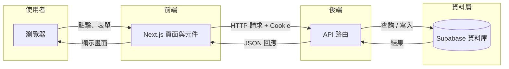

---

## 圖 2：客戶從訪客到回覆的旅程

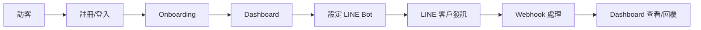

---

## 圖 3：LINE 訊息到 AI 回覆的詳細流程

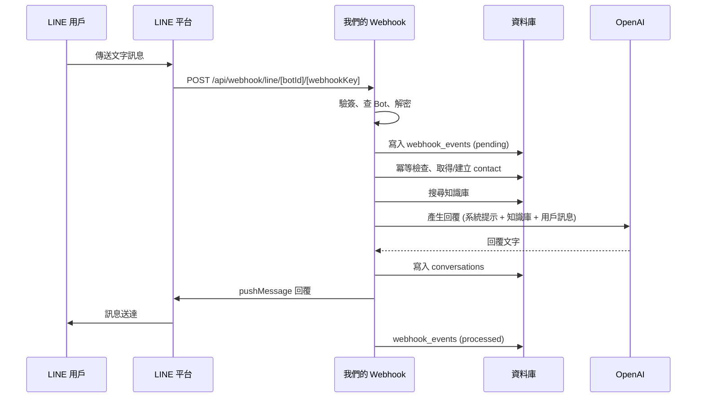

---

## 圖 4：誰能碰什麼（三種角色）

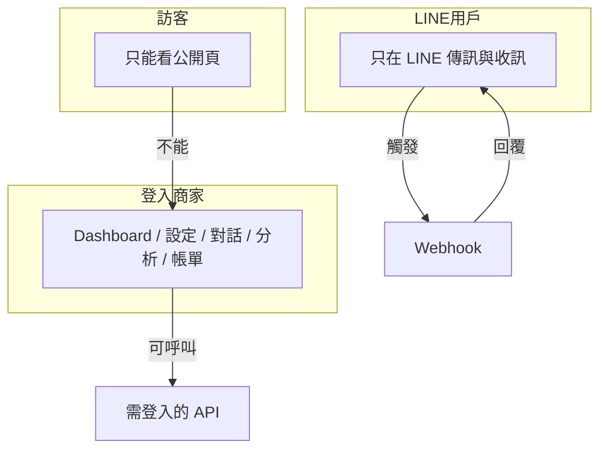

---

## 圖 5：請求與回應三角關係

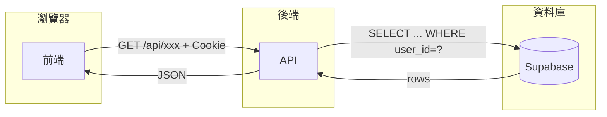

---

## 圖 6：proxy 守門員邏輯

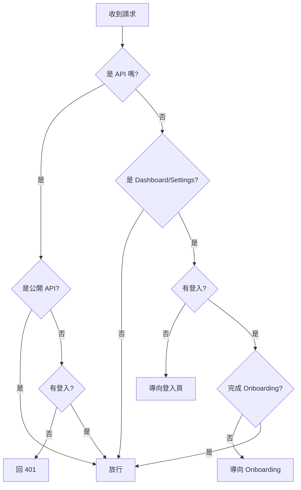

---

## 圖 7：資料表核心關係

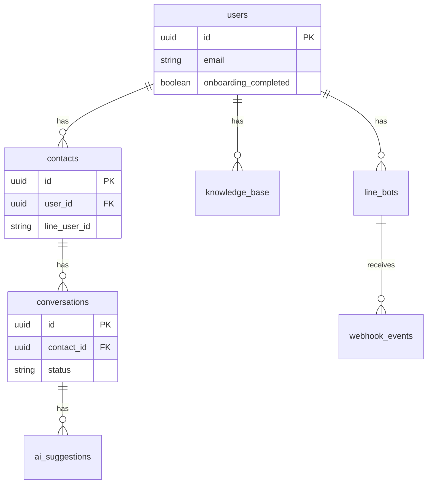

---

## 圖 8：決策層四種結果

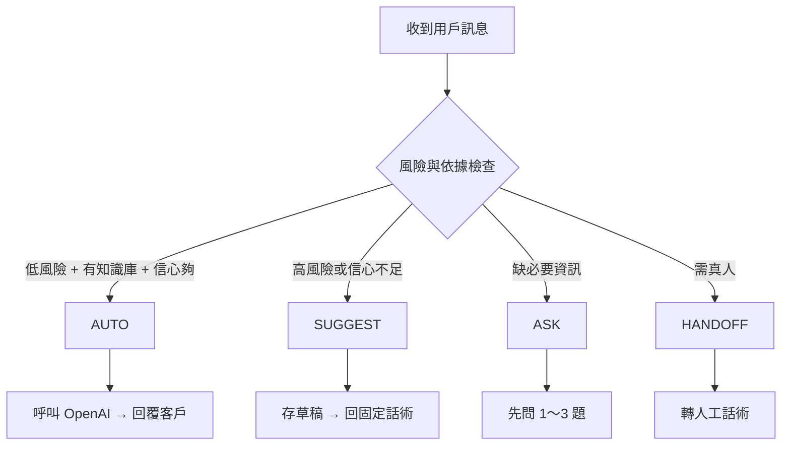

---

## 圖 9：知識庫搜尋流程

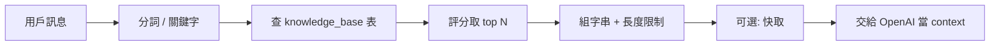

---

## 圖 10：多 Bot Webhook 驗證流程

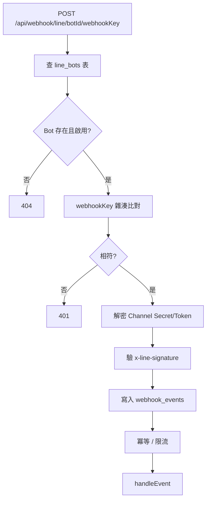

---

## 圖 11：從註冊到回覆的頁面與 API 對照

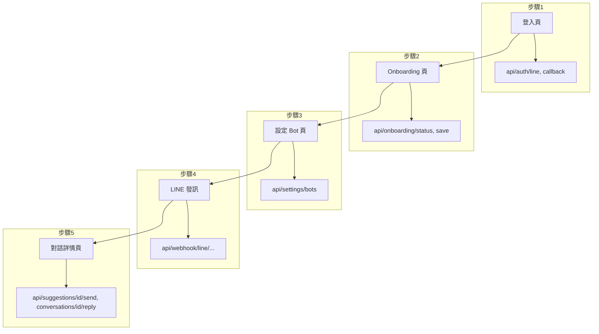

---

## 圖 12：方案與限制（概念）

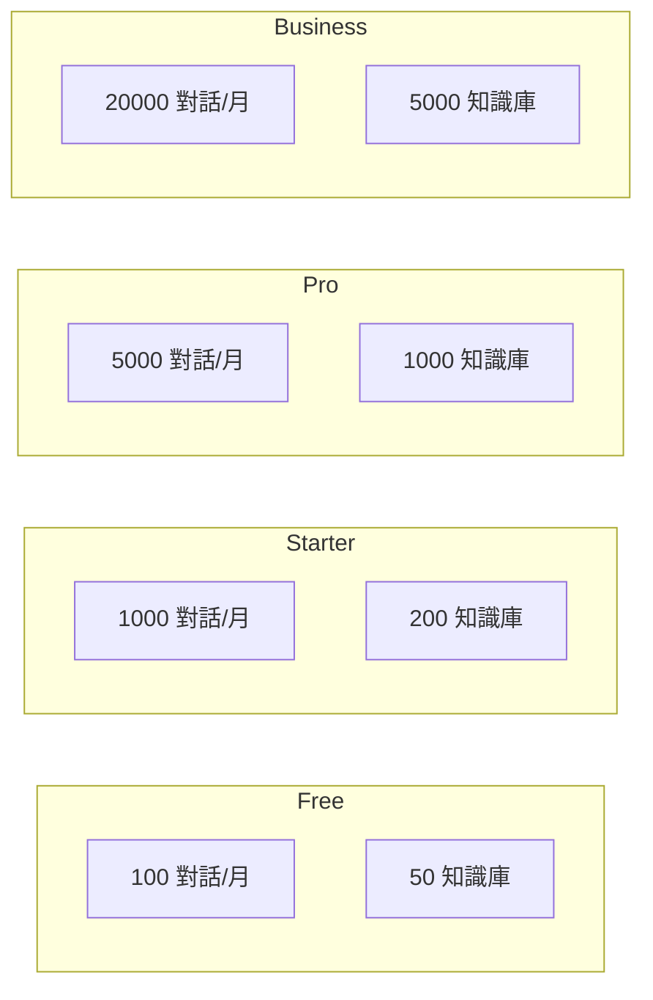

---

*以上圖表可依序複製到 Mermaid 編輯器匯出為圖片，再插入 Word，即可得到圖文並茂的完整教科書。*

---
