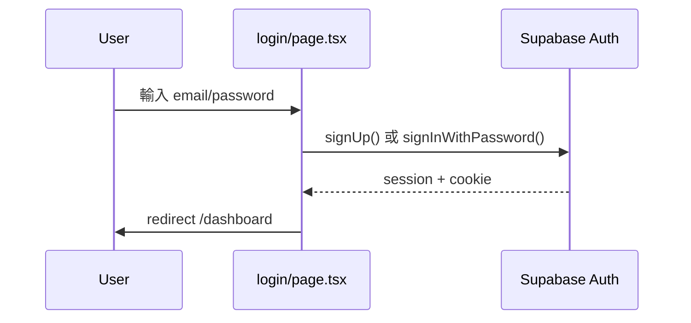
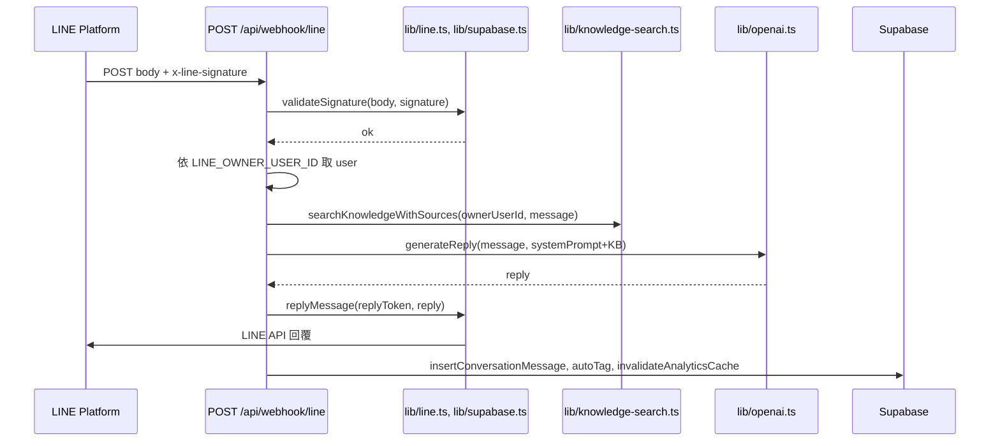
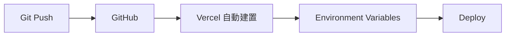

# CustomerAIPro 整合狀態報告

## Table of Contents
- [6.1 服務連接狀態表](#61-服務連接狀態表)
- [6.2 環境變數清單](#62-環境變數清單)
- [6.3 資料流圖](#63-資料流圖)
- [6.4 待修復問題清單](#64-待修復問題清單)
- [6.5 優化建議](#65-優化建議)

---

## 6.1 服務連接狀態表

| 服務 | 狀態 | 設定位置 | 說明 |
|------|------|----------|------|
| **GitHub** | ✅ | `git remote` → origin (mason113074-cyber/chat) | 已連接；已有 CI（PR/push main：type-check → lint → test:unit:run → build）；Dependabot：npm weekly |
| **Supabase** | ✅ | `lib/supabase/server.ts`, `lib/supabase/client.ts`, `lib/supabase.ts` | URL/Anon Key/Service Role 已使用；migrations 完整；RLS 已啟用 |
| **Vercel** | ✅ | `vercel.json`（cron 健康檢查） | 部署依專案規則為 Vercel；build/start 正常；無 `middleware.ts`（next-intl 使用 i18n/request） |
| **LINE** | ✅ | `lib/line.ts`（env：LINE_CHANNEL_SECRET, LINE_CHANNEL_ACCESS_TOKEN）；multi-bot 設定於 `line_bots` 表（加密儲存） | **multi-bot**：每個 bot 的 webhook URL 為 `/api/webhook/line/{botId}/{webhookKey}`，channel secret/token 加密存於 DB。**legacy** `/api/webhook/line` 在 production 預設回傳 **410 Gone**（可設 `LINE_WEBHOOK_LEGACY_ENABLED=true` 重新啟用，供舊版單 bot 短期過渡） |
| **OpenAI** | ✅ | `lib/openai.ts`（OPENAI_API_KEY） | 已整合；超時與重試可設定 |
| **Upstash Redis** | ⚠️ | `lib/rate-limit.ts`, `lib/idempotency.ts`, `lib/cache.ts` | **本機開發選用**；未設定時使用記憶體 fallback（單 instance）。**multi-bot production 必填**：多 instance Vercel 部署下，未設定 Redis 冪等與 rate limit 僅在單機生效，系統會輸出警告。 |
| **Lemon Squeezy** | ⚠️ | `.env.example` 有變數 | 選用；API 有 subscription/payments 端點，實際串接待實作 |

---

## 6.2 環境變數清單

### 必填（無則無法正常運作）

| 變數 | 用途 | 使用處 |
|------|------|--------|
| `NEXT_PUBLIC_SUPABASE_URL` | Supabase 專案 URL | server/client/createClient |
| `NEXT_PUBLIC_SUPABASE_ANON_KEY` | 匿名金鑰（前端 + 服務端 session） | server/client/createClient |
| `SUPABASE_SERVICE_ROLE_KEY` | 服務角色（webhook、後台、跨租戶） | `lib/supabase.ts` getSupabaseAdmin |
| `OPENAI_API_KEY` | OpenAI API | `lib/openai.ts`, health-check |
| `LINE_CHANNEL_SECRET` | LINE Webhook 簽章驗證（legacy 單 bot） | `lib/line.ts` validateSignature |
| `LINE_CHANNEL_ACCESS_TOKEN` | LINE 回覆訊息（legacy 單 bot） | `lib/line.ts` getLineClient |
| `LINE_OWNER_USER_ID` | Webhook 對應的「業主」user id（legacy 單 bot） | `app/api/webhook/line/route.ts` |
| `LINE_BOT_ENCRYPTION_KEY` | multi-bot 模式：`line_bots` 表的 channel secret/token 加密金鑰（AES-256） | `lib/encrypt.ts` |

### 選填 / 功能開關

| 變數 | 用途 | 備註 |
|------|------|------|
| `OPENAI_TIMEOUT_MS` | OpenAI 請求超時 | 預設 30000 |
| `OPENAI_MAX_RETRIES` | 重試次數 | 預設 2 |
| `UPSTASH_REDIS_REST_URL` | Redis（rate limit、冪等、快取） | **本機選用**；**multi-bot production 必填**（多 instance 下無 Redis 冪等僅限單機） |
| `UPSTASH_REDIS_REST_TOKEN` | Redis 認證 | 同上 |
| `LINE_WEBHOOK_LEGACY_ENABLED` | 重新啟用 legacy webhook `/api/webhook/line` | 預設空（production 回 410）；設 `true` 可重新啟用（短期過渡） |
| `LINE_LOGIN_CHANNEL_ID` / `LINE_LOGIN_CHANNEL_SECRET` | LINE Login（綁定帳號） | `/api/auth/line` |
| `NEXT_PUBLIC_APP_URL` | 站點 URL（OAuth callback、sitemap、robots） | 預設 https://www.customeraipro.com |
| `HEALTHCHECK_CRON_SECRET` | 健康檢查 cron 驗證 | Vercel cron 呼叫 `/api/health-check` |
| `SECURITY_STRICT_MODE` | 敏感詞嚴格模式 | 預設 true |
| `SECURITY_OUTPUT_FILTER_TIMEOUT` | 輸出過濾超時 | 預設 5000 |
| `LEMONSQUEEZY_*` | Lemon Squeezy 付款 | 選用 |
| `DISCORD_WEBHOOK_URL` / `SLACK_WEBHOOK_URL` | 告警 | 選用 |
| `TEST_*` | E2E 測試 | 勿提交 |

### 前端可見（NEXT_PUBLIC_）

- `NEXT_PUBLIC_SUPABASE_URL`
- `NEXT_PUBLIC_SUPABASE_ANON_KEY`
- `NEXT_PUBLIC_APP_URL`

其餘皆為 **server-only**。

---

## 6.3 資料流圖

### 用戶註冊/登入（無 API 層）

- 註冊/登入皆在 **前端** 直接呼叫 Supabase Auth，無經由自建 API route。
- Session 由 Supabase 寫入 Cookie；各 API 以 `createClient()`（server）或 `getAuthFromRequest()` 取得 user。

### LINE 訊息 → AI 回覆

### 知識庫「上傳」（無 Storage）

- 知識庫內容存於 **Supabase 表 `knowledge_base`**（文字欄位），**未使用 Supabase Storage**。
- 新增：`POST /api/knowledge-base`（單筆）或 `POST /api/knowledge-base/import`（items 陣列）。
- 前端可先解析檔案（如 CSV）再送 JSON；無二進位檔案上傳 API。

### 部署流程

- 已有 GitHub Actions（`.github/workflows/ci.yml`）：PR/push main 會跑 type-check / lint / unit / build；部署仍由 **Vercel 連動 GitHub**（push main 自動 build + deploy + 環境變數）。

---

## 6.4 待修復問題清單

- [ ] **GitHub branch protection（低）**：可在 GitHub 設定 main 保護（Require status checks：CI；禁止直接 push main）。CI 已存在。
- [x] **LINE 多租戶**（已實作）：multi-bot 模式支援每用戶自己的 LINE Channel；channel secret/token 加密存於 `line_bots` 表，webhook URL 為 `/api/webhook/line/{botId}/{webhookKey}`。legacy endpoint `/api/webhook/line` 在 production 預設 410 Gone，可設 `LINE_WEBHOOK_LEGACY_ENABLED=true` 重新啟用（舊版單 bot 過渡用）。
- [ ] **Supabase 型別未生成**（低）：專案無 `types/database.types.ts` 或 `supabase gen types` 產物，表結構僅在 migrations 與程式內散落。建議定期執行 `supabase gen types typescript` 並寫入 repo，以利型別安全。
- [ ] **.env.example 與實際使用對照**（低）：`LINE_LOGIN_CHANNEL_SECRET` 在 .env.example 為 `LINE_LOGIN_CHANNEL_SECRET`，程式使用相同名稱；`LINE_CHANNEL_SECRET` 在 .env.example 為 `LINE_CHANNEL_SECRET`，與 `lib/line.ts` 一致。已涵蓋主要變數；若有新增 env 請同步更新 .env.example。
- [ ] **無 CORS 設定**（低）：API 未回傳 `Access-Control-*` headers；若未來需從其他 domain 的 SPA 呼叫 API，需在對應 route 或 middleware 加上 CORS。

---

## 6.5 優化建議

1. **GitHub Actions**：已存在 `.github/workflows/ci.yml`（PR/push main 跑 type-check、lint、test:unit:run、build）。可選啟用 branch protection：Require status checks、禁止直接 push main。
2. **Vercel 環境變數**：在 Vercel Dashboard 對照 `.env.example` 檢查所有必填與選填變數是否已設定（尤其 `LINE_OWNER_USER_ID`、`HEALTHCHECK_CRON_SECRET`）。
3. **Rate limit / 冪等**：正式環境建議設定 Upstash Redis，避免多 instance 下 rate limit 與冪等僅在單機生效。
4. **Webhook 錯誤仍回 200**：目前為避免 LINE 重試，catch 後仍 `return NextResponse.json({ success: true })`；日誌已記錄錯誤。可考慮在嚴重錯誤時回 5xx 並在監控告警中區分「預期錯誤」與「需重試」。
5. **健康檢查 cron**：`vercel.json` 已設定 `/api/health-check` 每 15 分鐘；請確認 Vercel 專案中已設定 `HEALTHCHECK_CRON_SECRET`，且 health-check 內驗證該 secret。
6. **middleware**：目前無根目錄 `middleware.ts`；next-intl 使用 `i18n/request.ts`。若需全域 auth 重導、geo、A/B，可再引入 middleware 並與 next-intl 相容。

---

## 檢查摘要（對應指令 Part 1–5）

### Part 1: GitHub
- 已有 `.github/workflows/ci.yml`：PR/push main 會跑 type-check、lint、test:unit:run、build。
- Dependabot：npm weekly（`.github/dependabot.yml`）。
- `git remote`: origin → https://github.com/mason113074-cyber/chat.git；分支：main。
- `.gitignore` 已含 `node_modules`、`.env*.local`、`.env`，敏感檔未提交。

### Part 2: Supabase
- Client：`lib/supabase/client.ts`（createBrowserClient）、`lib/supabase/server.ts`（createServerClient）。
- Admin：`lib/supabase.ts`（getSupabaseAdmin，使用 `SUPABASE_SERVICE_ROLE_KEY`）。
- 環境變數：`NEXT_PUBLIC_SUPABASE_URL`、`NEXT_PUBLIC_SUPABASE_ANON_KEY`、`SUPABASE_SERVICE_ROLE_KEY` 均有使用。
- Migrations：`supabase/migrations/` 共 22 支（001 起）；001 已建立 users, contacts, conversations 等並啟用 RLS；後續有 health_check_logs、openai_usage、contact_tags 等。
- Auth：Supabase Auth；登入/註冊在 `app/[locale]/login/page.tsx` 直接呼叫；密碼重設在 `forgot-password/page.tsx`；無獨立 `app/auth/` 目錄。
- RLS：001 已為 users, contacts, conversations, orders, subscriptions 建立 policy；019 為 health_check_logs 建立讀取 policy。

### Part 3: Vercel
- `vercel.json` 僅設定 crons：`/api/health-check` 每 15 分鐘。
- 環境變數見 6.2；build/start 依 `package.json`（next build / next start）。
- 無根目錄 `middleware.ts`；i18n 透過 `i18n/request.ts` 與 next-intl plugin。
- API 為 Node 執行環境；webhook 與 chat 有 try/catch，回應時間在合理範圍內。

### Part 4: 跨服務流程
- 註冊：前端 form → Supabase Auth.signUp；無自建 API；成功後可導向 dashboard；Email 驗證依 Supabase 專案設定。
- 資料儲存：Frontend → API Route → Supabase（insert/update）；RLS 已啟用；錯誤處理以 try/catch + NextResponse.json 為主。
- 知識庫：無 Supabase Storage；為 DB 表 `knowledge_base` 的 CRUD + import（JSON body）。
- 部署：Git push → GitHub → Vercel 自動建置與部署；環境變數需在 Vercel 設定。

### Part 5: 潛在問題
- 環境變數：.env.example 與程式使用一致；無明顯遺漏。
- CORS：未設定；目前同源請求無需 CORS。
- Rate limiting：已實作（Upstash 或記憶體）；見 6.4 建議。
- 錯誤處理：關鍵 API（含 webhook）有 try/catch；webhook 刻意回 200 避免 LINE 重試。
- TypeScript：無 Supabase 自動生成型別；見 6.4。

---

*報告產生自專案掃描與程式碼檢查。*
