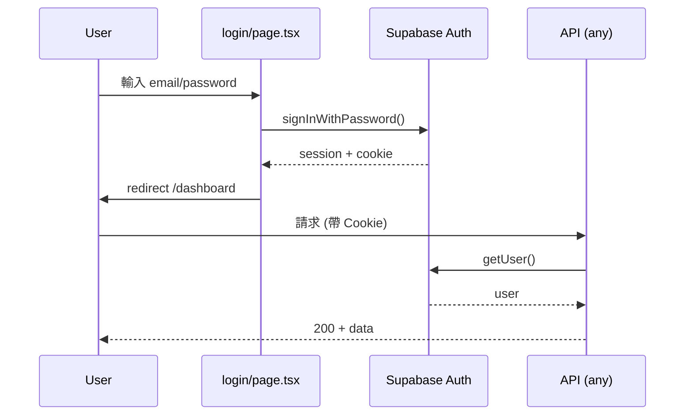
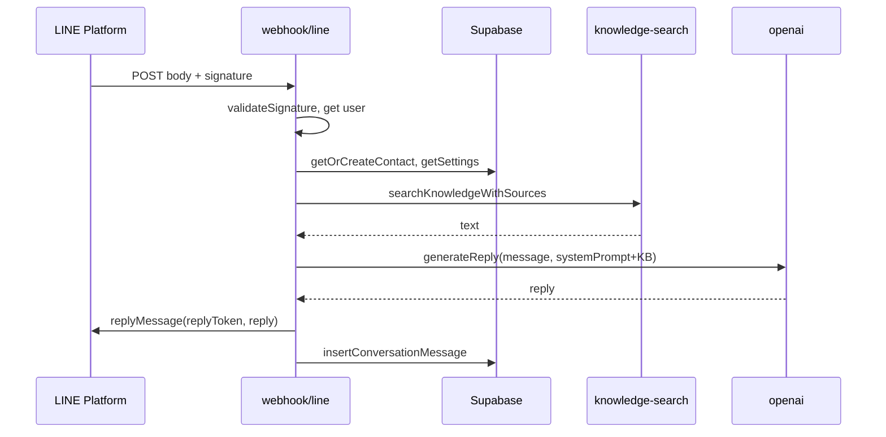

# CustomerAIPro 前後端邏輯流程

## Table of Contents
- [3.1 用戶註冊/登入流程](#31-用戶註冊登入流程)
- [3.2 LINE 整合流程](#32-line-整合流程)
- [3.3 知識庫上傳流程](#33-知識庫上傳流程)
- [3.4 AI 對話流程](#34-ai-對話流程)
- [3.5 Help Center 渲染流程](#35-help-center-渲染流程)

---

## 3.1 用戶註冊/登入流程

```
User Action → Frontend (login page) → Supabase Auth (client) → Supabase Backend → Session/Cookie → Redirect
```

### 涉及檔案

| 角色 | 檔案路徑 | 說明 |
|------|----------|------|
| 前端頁面 | `app/[locale]/login/page.tsx` | 登入/註冊表單，`useState` 管理 email/password，`?signup=true` 切換註冊 |
| Auth Client | `lib/supabase/client.ts` | 瀏覽端 Supabase client，用於 `signInWithPassword` / `signUp` |
| 服務端驗證 | `lib/auth-helper.ts` | `getAuthFromRequest`：從 Request 取得 user（Cookie 或 Bearer） |
| 服務端 DB | `lib/supabase/server.ts` | 服務端 `createClient()`，用於 API 內 `supabase.auth.getUser()` |

### 流程說明

1. **註冊**  
   - 使用者於 `/[locale]/login?signup=true` 填寫 email、password、confirmPassword。  
   - 前端呼叫 `supabase.auth.signUp({ email, password })`。  
   - Supabase 處理註冊並設定 session；若有 email 確認則依 Supabase 設定。  
   - 成功後可 `router.push('/dashboard')` 或導向 onboarding。

2. **登入**  
   - 使用者於 `/[locale]/login` 填寫 email、password。  
   - 前端呼叫 `supabase.auth.signInWithPassword({ email, password })`。  
   - Session 寫入 Cookie，之後同一 domain 的 API 會自動帶 Cookie。

3. **API 端驗證**  
   - 各 API 使用 `createClient()`（server）取得 `supabase.auth.getUser()`，或使用 `getAuthFromRequest(request)`（支援 Cookie + Bearer）。  
   - 未授權則回傳 `401`。

4. **Session 管理**  
   - 由 Supabase Auth + `@supabase/ssr` 處理 Cookie；無自建 JWT 發放。  
   - 登出：前端呼叫 `supabase.auth.signOut()`。

---

## 3.2 LINE 整合流程

```
User Input (Channel ID/Secret/Token) → Frontend Form → API PUT /api/settings/line → Validate & Save to DB (users) → Webhook URL 提供給用戶設定
```

### 涉及檔案

| 角色 | 檔案路徑 | 說明 |
|------|----------|------|
| 表單/頁面 | `app/[locale]/dashboard/settings/page.tsx`（或內嵌設定區） | LINE Channel 設定表單 |
| API 讀取 | `app/api/settings/line/route.ts` GET | 回傳 `channel_id`、masked secret/token |
| API 寫入 | `app/api/settings/line/route.ts` PUT | 驗證 body 後更新 `users` 表 |
| 驗證/發送 | `app/api/settings/line/test/route.ts` POST | 測試 LINE 連線（可選） |
| LINE 工具 | `lib/line.ts` | 簽章驗證、回覆訊息、型別 |
| Webhook | `app/api/webhook/line/route.ts` | 接收 LINE 事件，需從 users 讀取該帳號的 channel_secret / access_token |

### 流程說明

1. **表單**  
   - 使用者於 Dashboard 設定頁輸入 LINE Channel ID、Channel Secret、Channel Access Token。  
   - 前端送 PUT `/api/settings/line`，body: `{ channel_id, channel_secret, access_token }`。

2. **驗證與儲存**  
   - `PUT` 內以 `supabase.auth.getUser()` 取得 `user.id`。  
   - 檢查 `channel_id` / `channel_secret` / `access_token` 為非空字串（secret/token 若為 masked 字樣則不更新）。  
   - 更新 `users` 表：`line_channel_id`, `line_channel_secret`, `line_channel_access_token`。  
   - 不呼叫 LINE API 驗證 token（可選在 test route 做）。

3. **Webhook URL**  
   - 由部署網域決定，例如 `https://<domain>/api/webhook/line`。  
   - 使用者將此 URL 填到 LINE Developers Console 的 Webhook URL。  
   - 收到事件時，由 `lib/line.ts` 的 `validateSignature` 用該使用者的 `line_channel_secret` 驗證，再依 `line_channel_id` 對應到 user，用對應的 `line_channel_access_token` 回覆。

4. **LINE 登入綁定**  
   - `GET /api/auth/line` 導向 LINE OAuth；`GET /api/auth/line/callback` 處理 callback，將 LINE 帳號與既有 user 綁定（寫入 DB）。  
   - `POST /api/auth/line/unbind` 解除綁定。

---

## 3.3 知識庫上傳流程

```
File/Form Upload or Import JSON → Frontend → API POST /api/knowledge-base or /api/knowledge-base/import → Validate → Insert into Supabase (knowledge_base) → Clear Cache → AI 查詢時可用
```

### 涉及檔案

| 角色 | 檔案路徑 | 說明 |
|------|----------|------|
| 上傳/列表頁 | `app/[locale]/dashboard/knowledge-base/page.tsx` | 知識庫列表、新增、上傳或匯入 UI |
| 列表/新增 API | `app/api/knowledge-base/route.ts` | GET 分頁列表；POST 單筆新增（title, content, category） |
| 批次匯入 API | `app/api/knowledge-base/import/route.ts` | POST body: `{ items: [{ title, content, category? }] }` |
| 單筆更新/刪除 | `app/api/knowledge-base/[id]/route.ts` | PUT、DELETE |
| 快取 | `lib/knowledge-search.ts` | `clearKnowledgeCache(user.id)` 於新增/更新/刪除後呼叫 |
| 搜尋（AI 用） | `lib/knowledge-search.ts`、`lib/knowledge.ts` | `searchKnowledgeWithSources` / `searchKnowledgeForUser`：依 user 查 knowledge_base，回傳文字給 GPT |

### 流程說明

1. **上傳/新增**  
   - 前端可送單筆 POST `/api/knowledge-base`（title, content, category）或批次 POST `/api/knowledge-base/import`（items 陣列）。  
   - category 需在 `['general', '常見問題', '產品資訊', '退換貨政策', '營業資訊', '其他']` 內，否則 fallback `general`。

2. **檔案處理**  
   - 目前 API 接收的是 **已解析的 title/content**（或 JSON items），不做檔案二進位上傳；若有「上傳檔案」UI，前端需先解析（例如 CSV/Excel 轉成 items）再呼叫上述 API。  
   - 無 S3/檔案儲存：內容存於 Supabase `knowledge_base` 表（user_id, title, content, category, is_active 等）。

3. **儲存與快取**  
   - 寫入 `knowledge_base` 後呼叫 `clearKnowledgeCache(user.id)`，之後 AI 查詢會重新從 DB 取最新資料（或透過既有搜尋邏輯）。

4. **AI 如何讀取**  
   - Webhook 或 `/api/chat` 呼叫 `searchKnowledgeForUser(userId, message, 3, 2000)` 或 `searchKnowledgeWithSources`，取得與使用者問題相關的知識庫片段，拼進 system prompt 再呼叫 `generateReply`。

---

## 3.4 AI 對話流程

### 3.4.1 LINE 用戶發訊 → AI 回覆

```
User Message (LINE App) → LINE Platform → POST /api/webhook/line → Validate Signature → Load User Settings & KB → GPT-4 → Generate Reply → Send to LINE → Store Conversation (DB)
```

### 涉及檔案

| 角色 | 檔案路徑 | 說明 |
|------|----------|------|
| Webhook 入口 | `app/api/webhook/line/route.ts` | POST：收 LINE body，驗證簽章，依 event 處理 message |
| 簽章/回覆 | `lib/line.ts` | `validateSignature`, `replyMessage`；需該 user 的 channel_secret / access_token |
| 聯絡人/對話 | `lib/supabase`（或同專案 DB 模組） | `getOrCreateContactByLineUserId`, `getRecentConversationMessages`, `insertConversationMessage` |
| 使用者設定 | `getUserSettings`、users 表 | system_prompt, ai_model |
| 知識庫 | `lib/knowledge-search.ts` | `searchKnowledgeWithSources` 取得 KB 片段 |
| AI | `lib/openai.ts` | `generateReply(message, systemPrompt, aiModel, ...)` |
| 方案上限 | `lib/billing-usage.ts` | `getConversationUsageForUser`，超過則不回覆或回傳達上限訊息 |
| 冪等 | `lib/idempotency.ts` | `isProcessed` / `markAsProcessed`（以 webhook event id 等） |
| 速率限制 | `lib/rate-limit.ts` | `checkRateLimit` |
| 敏感詞 | `lib/security/sensitive-keywords.ts` | `detectSensitiveKeywords` |
| 分析快取 | `lib/analytics-cache.ts` | 必要時 `invalidateAnalyticsCache` |

### 流程說明

1. LINE 伺服器對 `POST /api/webhook/line` 送 body + `x-line-signature`。  
2. 用 `validateSignature(body, signature)` 驗證（需正確的 channel_secret）；可依 `destination` 或已綁定關係決定對應 user。  
3. 依 `source.userId` 取得或建立 contact，檢查 rate limit、冪等、對話數上限。  
4. 若為 message 事件：  
   - 載入該 user 的 system_prompt、ai_model；  
   - 呼叫 `searchKnowledgeWithSources` 取得 KB 片段；  
   - 組 system prompt（含 KB 或「無相關內容請轉專人」）；  
   - 敏感詞檢測，必要時回覆固定安全訊息；  
   - 呼叫 `generateReply(..., previousMessages)`；  
   - 過濾輸出、長度限制後 `replyMessage` 回傳 LINE；  
   - 寫入 conversation/message 到 DB，更新解析狀態，可觸發 auto-tag。  
5. GET `/api/webhook/line` 可做為 LINE 驗證 URL（回傳 200 等）。

### 3.4.2 儀表板內建聊天（Test Chat）

```
User Input (Dashboard) → POST /api/chat → getAuthFromRequest / getUser → Load KB & Settings → generateReply → Return JSON { content }
```

### 涉及檔案

- **前端**：Dashboard 內測試聊天區（呼叫 `POST /api/chat`，body `{ message }`）。  
- **API**：`app/api/chat/route.ts`  
  - 取得 user，檢查對話上限；  
  - 讀取 users 表 system_prompt、ai_model；  
  - `searchKnowledgeForUser(user.id, message, 3, 2000)`；  
  - `generateReply(message, systemPrompt, aiModel)`；  
  - 回傳 `{ content }`。

---

## 3.5 Help Center 渲染流程

```
User Visit /help → [locale] → help/page.tsx → Load Categories (靜態) → Render List → Click Category → /help/[category] → [category]/page.tsx → Render Article List → Click Article → /help/[category]/[article] → getArticleContent → Render or notFound()
```

### 涉及檔案

| 角色 | 檔案路徑 | 說明 |
|------|----------|------|
| Help 首頁 | `app/[locale]/help/page.tsx` | 靜態分類卡片、搜尋（client 過濾）、Other resources 連結 |
| 分類列表 | `app/[locale]/help/[category]/page.tsx` | 依 `params.category` 顯示該分類文章列表 |
| 單篇文章 | `app/[locale]/help/[category]/[article]/page.tsx` | `getArticleContent(category, article)`，無則 `notFound()` |
| 文章資料來源 | `lib/help-articles.ts` | `HELP_CATEGORIES`, `ARTICLE_LIST`, `ARTICLE_CONTENT`；`getArticleContent(category, article)` 回傳 `ArticleContent \| null` |
| i18n | `messages/en.json`, `messages/zh-TW.json` | `help.*` 鍵對應標題、描述、內文標題等 |
| 404 | `app/[locale]/help/not-found.tsx` | Help 區 404 頁 |

### 流程說明

1. **文章內容來源**  
   - 內容在 `lib/help-articles.ts` 的 `ARTICLE_CONTENT`（key 為 `category/article`），每筆含 `categorySlug`, `titleKey`, `readTime`, `lastUpdated`, `contentHtml`。  
   - 標題等文案來自 `titleKey` + next-intl（`t(content.titleKey)`），故 i18n 切換會改變顯示語言。

2. **動態路由解析**  
   - `[category]` 需在 `HELP_CATEGORIES` 內（getting-started, line-integration, knowledge-base, settings, billing, analytics）。  
   - `[article]` 需在 `ARTICLE_LIST[category]` 的 slug 內。  
   - `getArticleContent(category, article)` 回傳 `null` 時，文章頁呼叫 `notFound()`。

3. **i18n**  
   - `[locale]` 由 next-intl 與 routing 決定；Help 頁使用 `useTranslations('help')` 或 `getTranslations('help')`，依 locale 載入對應 messages。

4. **404**  
   - 無對應 category/article 時由 `notFound()` 觸發，顯示 `help/not-found.tsx`（若存在）或上層 not-found。

---

## 流程圖（Mermaid）

### 登入 / Session



### LINE Webhook → AI 回覆



---

*最後更新：依專案程式碼分析生成。*
