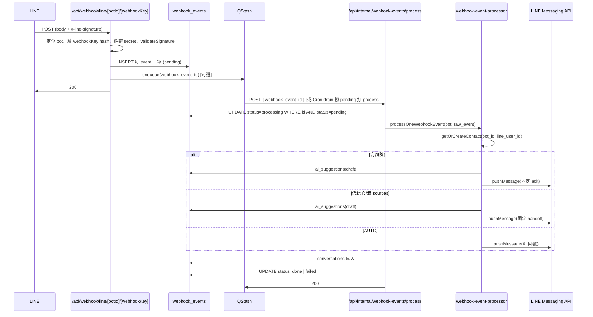

# B1 實作報告：事件落地→立即 200→背景處理→pushMessage 回覆（多 Bot + AI 副駕）

**日期**：2025-02-21  
**範圍**：Webhook 僅驗簽與寫入 webhook_events（一事件一筆）並立即 200；背景由 QStash 或 Cron drain 觸發 process；處理端僅使用 pushMessage 回覆；決策層 SUGGEST / AUTO / ASK / HANDOFF；多 bot 驗簽與加密。

---

## 1. 本次 Git commit 清單（建議至少 8 個小 commit）

| # | 建議 commit 訊息 | 說明 |
|---|------------------|------|
| 1 | feat(db): B1 migration 030 webhook_events per-event, line_bots/contacts/ai_suggestions | 一事件一筆、bot 維度、encryption_version、category/sources |
| 2 | feat(lib): add lib/crypto/envelope.ts AES-256-GCM + ENCRYPTION_MASTER_KEY | 支援 encryption_version 輪替 |
| 3 | feat(lib): getOrCreateContactByLineUserId 支援 bot_id；contacts.bot_id | 多 bot 維度聯絡人 |
| 4 | feat(lib): qstash enqueueWebhookEventProcess(webhook_event_id) | 寫入事件後 enqueue 至 QStash |
| 5 | feat(webhook): B1 僅驗簽→寫入 webhook_events→200，不執行 handleEvent | /api/webhook/line/[botId]/[webhookKey] |
| 6 | feat(internal): POST /api/internal/webhook-events/process + webhook-event-processor | 鎖 pending→處理→pushMessage→更新狀態 |
| 7 | feat(internal): POST /api/internal/webhook-events/drain + vercel cron 每分鐘 | Cron 保命 fallback |
| 8 | chore(env): B1 env 說明 ENCRYPTION_MASTER_KEY, QSTASH_TOKEN, APP_URL, INTERNAL_QUEUE_SECRET | .env.example |
| 9 | docs: add IMPLEMENTATION_B1_EVENT_QUEUE_MULTIBOT report | 本報告 |

---

## 2. 新增/修改的檔案清單

### Migrations
| 檔案 | 說明 |
|------|------|
| `supabase/migrations/030_b1_event_queue_multibot.sql` | webhook_events 一事件一筆（event_id, event_type, raw_event, status, attempts）；line_bots 新增 channel_id, encryption_version, bot_name；ai_suggestions 新增 category, sources, dismissed_at；contacts 新增 bot_id、unique(bot_id, line_user_id) |

### API routes
| 檔案 | 說明 |
|------|------|
| `app/api/webhook/line/[botId]/[webhookKey]/route.ts` | B1：僅定位 bot→驗簽→每 event 寫入 webhook_events→enqueueWebhookEventProcess(id)→200 |
| `app/api/internal/webhook-events/process/route.ts` | POST { webhook_event_id }；驗證 Bearer INTERNAL_QUEUE_SECRET 或 Upstash-Signature；鎖 pending→processing；解密 bot token；呼叫 processOneWebhookEvent；更新 done/failed |
| `app/api/internal/webhook-events/drain/route.ts` | POST；驗證 HEALTHCHECK_CRON_SECRET；查 pending 限筆→逐筆 fetch process URL（Bearer INTERNAL_QUEUE_SECRET） |

### Lib
| 檔案 | 說明 |
|------|------|
| `lib/crypto/envelope.ts` | AES-256-GCM 加解密；ENCRYPTION_MASTER_KEY；encryption_version |
| `lib/qstash.ts` | enqueueWebhookEventProcess(webhookEventId) 呼叫 APP_URL + /api/internal/webhook-events/process |
| `lib/webhook-event-processor.ts` | processOneWebhookEvent：follow 歡迎；文字訊息→高風險 SUGGEST+固定 ack；低信心 SUGGEST+固定 handoff；否則 AUTO pushMessage(AI)+寫 conversations |
| `lib/supabase.ts` | Contact.bot_id；getOrCreateContactByLineUserId(..., botId?) 依 (bot_id, line_user_id) 查找/建立 |
| `lib/line.ts` | 既有：validateSignature(body, sig, channelSecret)；pushMessage(userId, message, credentials) |
| `lib/encrypt.ts` | 既有：legacy 解密（LINE_BOT_ENCRYPTION_KEY）；webhook/process 解密時 envelope 優先再 fallback legacy |

### Docs / 設定
| 檔案 | 說明 |
|------|------|
| `.env.example` | 新增 ENCRYPTION_MASTER_KEY、APP_URL、INTERNAL_QUEUE_SECRET、QSTASH_TOKEN 說明 |
| `vercel.json` | 新增 cron：每分鐘 /api/internal/webhook-events/drain |
| `docs/REPORTS/IMPLEMENTATION_B1_EVENT_QUEUE_MULTIBOT.md` | 本報告 |

---

## 3. B1 流程圖（Mermaid）

---

## 4. 多 Bot 驗簽流程說明

1. **Webhook URL**：`/api/webhook/line/[botId]/[webhookKey]`，以 botId 定位 bot，webhookKey 僅出現在 path，不存明文。
2. **webhookKey 驗證**：建立 bot 時以 `hashWebhookKey(webhookKey)`（SHA-256 hex）寫入 `line_bots.webhook_key_hash`；請求時對 path 的 webhookKey 做相同 hash 與 DB 比對，不符回 401。
3. **解密 channel_secret**：依 `line_bots.encryption_version` 用 `lib/crypto/envelope.ts` 的 decrypt（ENCRYPTION_MASTER_KEY）；若失敗則 fallback `lib/encrypt.ts` 的 decrypt（LINE_BOT_ENCRYPTION_KEY）。
4. **驗簽**：`validateSignature(body, x-line-signature, channelSecret)`，通過才寫入 webhook_events 並回 200。
5. **Process 端**：讀取同一 bot 的 `encrypted_channel_access_token`，同樣 envelope 優先再 legacy 解密，傳入 `processOneWebhookEvent`，僅使用 `pushMessage(..., credentials)` 回覆。

---

## 5. 副駕決策說明（SUGGEST / AUTO / ASK / HANDOFF）

| 情境 | 行為 | 程式路徑 |
|------|------|----------|
| **高風險**（退款/折扣/價格/運費/賠償/客訴等敏感詞） | 寫 `ai_suggestions`（status=draft），push **固定 ack**「已收到，我們將由專員協助處理」，不送 AI 回覆 | `lib/webhook-event-processor.ts`：`isHighRisk` → insert ai_suggestions + pushMessage(HIGH_RISK_ACK) |
| **非高風險 + sourcesCount>0 + confidence≥threshold** | **AUTO**：pushMessage(AI 回覆)，寫入 conversations | 同檔：未進高風險且未進低信心分支 → pushMessage(finalReply) + insertConversationMessage(assistant) |
| **sourcesCount=0 或 confidence&lt;threshold** | **SUGGEST / HANDOFF**：寫 `ai_suggestions`(draft)，push **固定**「這個問題需要專人為您處理，請稍候。」 | 同檔：`sources.length === 0 \|\| confidence.score < confidenceThreshold` → insert ai_suggestions + pushMessage(HANDOFF_MSG) |
| **follow 事件** | 歡迎訊息（若設定開啟） | 同檔：eventType === 'follow' → pushMessage(settings.welcome_message) |
| **非文字訊息** | 不處理（或可擴充固定回覆） | 同檔：eventType !== 'message' 或非 text 則 return |

---

## 6. 如何確保「高風險不會直接發 AI」：具體分支位置

- **lib/webhook-event-processor.ts**  
  - 約 76–101 行：`detectSensitiveKeywords` + `HIGH_RISK_KEYWORDS` 判斷 `isHighRisk`；若為 true，只做：
    - `insertConversationMessage(contact.id, userMessage, 'user')`
    - `admin.from('ai_suggestions').insert({ ..., risk_category: 'high', category: 'high_risk', status: 'draft', ... })`
    - `pushMessage(lineUserId, { type: 'text', text: HIGH_RISK_ACK }, creds)`
  - **不呼叫** `generateReply`、**不** push AI 產生的內容。
- **輸出 guardrail**（同檔）：FORBIDDEN_PATTERNS 與長度截斷僅作用於「非高風險」且「會送 AI 回覆」之路徑；高風險已在上述分支 return，不會進入後續 AI 生成與 pushMessage(finalReply)。

---

## 7. 測試結果

| 項目 | 結果 |
|------|------|
| `npm run lint` | 通過 |
| `npm run type-check` | 失敗：`e2e/audit.spec.ts(125,7)` 型別不符（boolean \| undefined 與 overload），為既有 e2e 檔案，非本次 B1 變更範圍，未修改。 |
| `npm run build` | 通過 |

---

## 附錄 A：Before / After（本輪實作前後）

- **Before**（本輪開始時）：`git status --porcelain` 有未提交變更；`npm run lint`、`npm run build` 通過（依前文紀錄）。
- **After**（本報告撰寫時）：
  - **Lint**：通過。
  - **Type-check**：仍因 `e2e/audit.spec.ts` 失敗，不修非 B1 範圍。
  - **Build**：通過；路由含 `/api/internal/webhook-events/process`、`/api/internal/webhook-events/drain`、`/api/webhook/line/[botId]/[webhookKey]`。

---

## 附錄 B：環境變數（僅列名稱，不洩漏值）

- **ENCRYPTION_MASTER_KEY**：B1 envelope 加解密用。
- **LINE_BOT_ENCRYPTION_KEY**：舊版 bot 密鑰/ token 加解密（fallback）。
- **INTERNAL_QUEUE_SECRET**：驗證 process / drain 呼叫（Bearer）。
- **HEALTHCHECK_CRON_SECRET**：驗證 drain cron。
- **QSTASH_TOKEN**：Upstash QStash 發送 process 請求（選用）。
- **APP_URL** 或 **NEXT_PUBLIC_APP_URL** / **VERCEL_URL**：drain 組 process URL 用。

---

（報告完）
