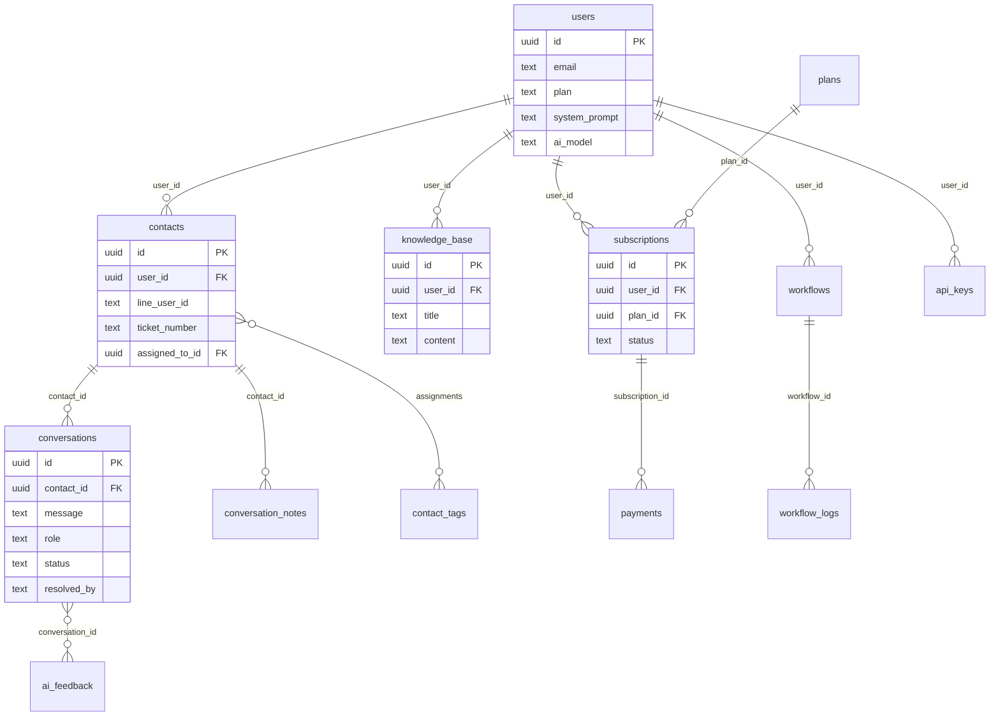
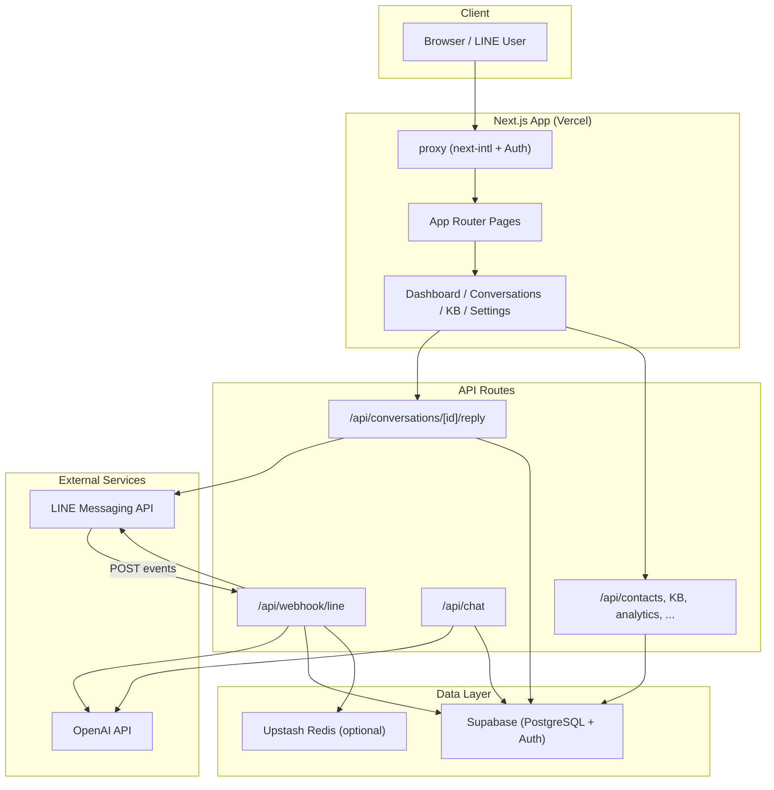
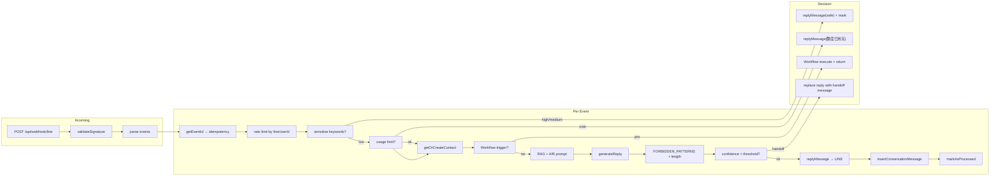

# PROJECT FULL AUDIT（專案全景報告）

**專案名稱**：CustomerAIPro（AI 智能客服 SaaS）  
**報告日期**：2025-02-21  
**審計範圍**：完整 repo 盤點與架構/產品/風險綜整

---

## 0. 摘要（TL;DR）

1. **專案定位**：CustomerAIPro 是 LINE-first 的 AI 智能客服 SaaS，整合 OpenAI GPT-4o-mini、Supabase、Vercel；目標為中小商家以共享收件匣 + AI 建議回覆 + 人工一鍵送出。
2. **目前完成度**：核心流程已打通：LINE Webhook → 驗簽/冪等/限流 → RAG 知識庫 → AI 回覆 → 信心分數/低信心轉人工、營業時間、工作流自動化、內部備註、工單欄位、API Key、Status 頁、分析匯出、E2E 覆蓋。
3. **最大風險（P0）**：**單一 LINE 頻道**：目前 `LINE_CHANNEL_SECRET` / `LINE_OWNER_USER_ID` 為全域一組，**不支援多租戶多 bot**；Webhook 錯誤時**固定回 200** 以避免 LINE 重試，錯誤被「吞掉」僅寫 log，需靠監控告警補強。
4. **RLS 與租戶隔離**：核心表（users, contacts, conversations, knowledge_base, subscriptions 等）皆已啟用 RLS，且 policy 以 `auth.uid() = user_id` 或「經 contact 所屬 user」隔離；Webhook/後台寫入使用 **service role** 繞過 RLS，邏輯上以 `LINE_OWNER_USER_ID` 對應單一 tenant，隔離正確。若未來改多 bot，須改為「依 destination 或 channel 解析 tenant」並 per-tenant 存 secret。
5. **AI 安全**：輸入有敏感詞分級（高/中/低）、輸出有 FORBIDDEN_PATTERNS 與字數截斷、output filter 防金額承諾/專業建議/內部資訊洩漏；高風險輸入在嚴格模式下直接回安全句不呼叫 AI。**副駕模式**：Dashboard 內「一鍵送出」為人工審核後送 LINE，API 寫入 `resolved_by: 'human'`，不會未經人工就自動發送。
6. **計費與用量**：方案定義在 `lib/plans.ts`（free/starter/pro/business），用量以「當月 assistant 訊息數」計，超額時 Webhook/Chat API 回覆額度已用完；無 Stripe/LemonSqueezy webhook 同步訂閱狀態的實作，訂閱狀態依 DB 手動或另行整合。
7. **測試與建置**：`npm run lint` 通過；`npm run type-check` 失敗（e2e/audit.spec.ts 型別問題）；`npm run build`、`npm run test:unit:run` 通過；E2E 為 Playwright，需 Supabase 與可選 .env.local 帳密。
8. **建議下一步**：修復 `type-check`（e2e 型別）；補齊 LemonSqueezy/付款 webhook 與訂閱同步（若要做線上付費）；規劃多租戶多 LINE 頻道（tenant 辨識、per-tenant secret 儲存）；加強 Webhook 錯誤可觀測性（結構化 log + Sentry/告警）。

---

## 1. 專案定位與產品輪廓（Website/產品視角）

- **產品**：CustomerAIPro — AI 智能客服 SaaS，正式網址 https://www.customeraipro.com 。
- **目標客群**：中小商家，需在 LINE 上以 AI 輔助回覆客戶、保留對話紀錄、必要時人工接手。
- **主要通路**：LINE-first（LINE Messaging API Webhook）；登入為 Supabase Auth（Email/密碼），另有 LINE Login 綁定。
- **核心 use cases**：
  - 共享收件匣：以聯絡人為維度的對話列表與詳情（`/dashboard/conversations`）。
  - AI 建議回覆：Webhook 收訊息 → RAG 檢索知識庫 → OpenAI 生成回覆；可設信心門檻、低信心轉人工或加免責。
  - 人工一鍵送出：客服在對話詳情輸入文字，呼叫 `POST /api/conversations/[id]/reply` 送 LINE 並寫入 conversation（role=assistant, resolved_by=human）。
  - 知識庫：CRUD、匯入、從對話納入 AI 品質（錯誤答案建議條目）、gap 分析。
  - 模板／行為：系統提示詞、自訂敏感詞、AI 行為指令（guidance）、回覆格式/長度/延遲、多語。
  - 工作流／自動化：視覺化流程（觸發條件：新訊息/關鍵字/新客/非營業時間）→ 動作（回覆、標籤等），寫入 `workflows` / `workflow_logs`。
  - 內部備註、工單（ticket_number、ticket_priority、assigned_to_id）、API Key、Status 頁、分析與匯出、滿意度回饋（👍👎）均已具備。
- **Crisp-like 對照**：已覆蓋收件匣、AI 回覆、人工送出、知識庫、標籤、狀態、備註、簡易工單、API Key、狀態頁、分析；尚未做多客服/多 bot、SLA、進階指派與權限分層。

---

## 2. 網站（Landing / Marketing Site）

| 項目 | 說明 |
|------|------|
| **頁面清單** | 首頁 `/[locale]`、`/demo`、`/pricing`、`/login`、`/forgot-password`、`/docs`、`/support`、`/terms`、`/privacy`、`/status`、`/help`（含 `/[category]/[article]`）；dashboard 與 settings 見 §3。 |
| **路由/檔案** | `app/[locale]/page.tsx`、`app/[locale]/demo/page.tsx`、`app/[locale]/pricing/page.tsx`、`app/[locale]/login/page.tsx`、`app/[locale]/help/` 等。 |
| **i18n** | next-intl，`i18n/request.ts`、`i18n/routing.ts`；locales：`zh-TW`、`en`。 |
| **CTA/轉換** | 登入/註冊導向 Supabase Auth；登入後進 dashboard；定價頁導向方案選擇與後續訂閱流程。 |
| **SEO / metadata** | `app/sitemap.ts`、`app/robots.ts`；各頁可自訂 metadata。 |
| **追蹤/分析** | 未見 GA、Meta pixel、PostHog、Sentry 等程式碼引用；若有宣稱需在風險章節標註。 |
| **靜態/品牌** | `public/`；品牌素材與 landing 元件在 `app/components/`（如 LandingNavbar、LandingFooter、LandingFAQ）。 |

---

## 3. 前端（App UI / Console）

| 主要頁面 | Route | 檔案路徑 | UI 策略 | 資料取得 | Auth |
|----------|-------|----------|---------|-----------|------|
| Dashboard 總覽 | /[locale]/dashboard | app/[locale]/dashboard/page.tsx | Tailwind + 自訂/共用元件 | fetch API、Supabase client | proxy 保護，未登入重導 /login |
| 收件匣 | /[locale]/dashboard/conversations | app/[locale]/dashboard/conversations/page.tsx | 同上 | fetch /api/conversations/counts、/api/contacts、列表與篩選 | 同上 |
| 對話詳情 | /[locale]/dashboard/conversations/[contactId] | app/[locale]/dashboard/conversations/[contactId]/page.tsx、ConversationPanel | 同上 | fetch /api/contacts/[id]、/api/contacts/tags、conversations 列表、status、reply | 同上 |
| 聯絡人 | /[locale]/dashboard/contacts | app/[locale]/dashboard/contacts/page.tsx | 同上 | fetch /api/contacts、tags、stats | 同上 |
| 知識庫 | /[locale]/dashboard/knowledge-base | app/[locale]/dashboard/knowledge-base/page.tsx | 同上 | fetch /api/knowledge-base、stats、import 等 | 同上 |
| AI 品質 | /[locale]/dashboard/ai-quality | app/[locale]/dashboard/ai-quality/page.tsx | 同上 | fetch /api/analytics/ai-quality、from-conversation 等 | 同上 |
| 分析 | /[locale]/dashboard/analytics | app/[locale]/dashboard/analytics/page.tsx | 同上 | fetch /api/analytics/* | 同上 |
| 設定 | /[locale]/dashboard/settings | app/[locale]/dashboard/settings/page.tsx | 同上 | fetch /api/settings、line、api-keys、guidance、preview 等 | 同上 |
| 帳單/用量 | /[locale]/dashboard/billing | app/[locale]/dashboard/billing/page.tsx | 同上 | fetch /api/billing/usage、plans、subscription | 同上 |
| 自動化 | /[locale]/dashboard/automations、/[id] | app/[locale]/dashboard/automations/page.tsx、[id]/page.tsx | 同上 + @xyflow/react 流程圖 | fetch /api/workflows | 同上 |
| 活動/行銷 | /[locale]/dashboard/campaigns、new、[id] | app/[locale]/dashboard/campaigns/*.tsx | 同上 | fetch /api/campaigns | 同上 |
| Onboarding | /[locale]/dashboard/onboarding | app/[locale]/dashboard/onboarding/page.tsx | 同上 | fetch /api/onboarding/status、save | 同上 |
| Status | /[locale]/status | app/[locale]/status/page.tsx | 靜態/SSG | 可接 health-check | 公開 |

- **狀態管理**：以 React state + fetch 為主，未使用 react-query/SWR 全域層。
- **錯誤與 loading**：各頁自行處理（error state、toast、skeleton）；dashboard 有 `error.tsx`、`loading.tsx`。
- **權限**：目前以「登入即可見自己的 dashboard」為主，無細粒度 RBAC（例如客服 vs 管理員）。
- **一鍵送出**：`ConversationPanel` 內輸入框 + 送出按鈕 → `onSendHumanReply(message)` → `fetch(\`/api/conversations/${selectedContactId}/reply\`, { method: 'POST', body: JSON.stringify({ message }) })`；後端見 §4。

---

## 4. 後端（API / Webhooks / Jobs）

### API 端點清單（摘要）

| 端點 | 方法 | 認證 | 摘要 | 主要表 |
|------|------|------|------|--------|
| /api/onboarding/status, /api/onboarding/save | GET, POST | session |  onboarding 狀態與儲存 | users |
| /api/knowledge-base, /api/knowledge-base/[id], /api/knowledge-base/import, import-url, from-conversation, gap-analysis, search, stats, test | GET/POST/PUT/DELETE | session | 知識庫 CRUD、匯入、搜尋、測試 | knowledge_base |
| /api/analytics/overview, trends, resolution, daily-trend, hourly, top-contacts, top-questions, quality, ai-quality, export | GET | session | 分析與匯出 | conversations, contacts, ai_feedback 等 |
| /api/billing/usage | GET | session | 當月用量與方案上限 | subscriptions, plans, conversations |
| /api/conversations/counts, /api/conversations/[id]/status, tags, batch | GET/PATCH/POST | session | 對話數、狀態、標籤、批次 | conversations, contacts |
| /api/conversations/[id]/reply | POST | session | **人工一鍵送出**：推送到 LINE 並寫入 assistant 訊息 | contacts, conversations（insertConversationMessage） |
| /api/conversations/[id]/takeover, handback | PUT | session | 接管/交還對話狀態 | conversations/contacts 狀態 |
| /api/contacts, /api/contacts/[id], tags, tags/[id], [id]/tags, [id]/notes, [id]/events, stats | GET/POST/PUT/DELETE | session | 聯絡人與標籤、備註、事件 | contacts, contact_tags, conversation_notes 等 |
| /api/settings, preview, line, line/test, api-keys, api-keys/[id], guidance, ab-test | GET/POST/PUT/DELETE | session | 設定、LINE、API Key、指引、A/B 測試 | users, api_keys, ai_guidance_rules, ab_tests 等 |
| /api/chat | POST | session（可選） | 測試用 AI 回覆（單則訊息） | users, knowledge_base, openai_usage |
| /api/search | GET | session | 全域搜尋 | 多表 |
| /api/plans | GET | 公開 | 方案列表 | plans |
| /api/subscription | GET/POST/PATCH | session | 訂閱查詢/建立/更新 | subscriptions, plans |
| /api/payments, usage | GET | session | 付款與用量 | payments, subscriptions |
| /api/workflows, [id], [id]/execute, [id]/logs | GET/POST/PUT/DELETE/POST | session | 工作流 CRUD 與執行、日誌 | workflows, workflow_logs |
| /api/campaigns, [id] | GET/POST/PUT/DELETE | session | 活動 CRUD | campaigns, campaign_logs |
| /api/auth/line, callback, status, unbind | GET/POST | session/callback | LINE Login 綁定/解綁 | users |
| /api/health-check, history, /api/health/* | GET | 部分需 cron secret | 健康檢查、歷史、Supabase/OpenAI/限流/敏感詞等 | health_check_logs 等 |
| /api/webhook/line | POST, GET | 簽章驗證 | LINE Webhook 接收與處理 | 見下節 |

### Webhook：LINE

- **驗簽**：`app/api/webhook/line/route.ts` 使用 `validateSignature(body, signature)`（`lib/line.ts`），以 `LINE_CHANNEL_SECRET` 做 HMAC-SHA256，不符回 **401**。
- **冪等**：`lib/idempotency.ts`，以 `webhookEventId ?? message.id ?? replyToken` 為 key，Redis 或記憶體儲存，TTL 1 小時；重複事件跳過處理。
- **Rate limit**：`lib/rate-limit.ts`，以 `lineUserId` 為 key，60 秒內最多 20 次；超限回覆「發送頻率過高」。
- **錯誤策略（深挖）**：  
  - **頂層 try/catch（route 第 116–125 行）**：任何例外時 `return NextResponse.json({ success: true });`，即**固定回 200**，註解寫明「Return 200 so LINE does not retry (avoid duplicate processing)」。  
  - **單一 event 內 try/catch（handleEvent 結尾 619–637 行）**：發生錯誤時記錄 log，並嘗試回覆「抱歉，處理您的訊息時發生錯誤。請稍後再試。」；**不重試**、不影響整體 200。  
  - **結論**：錯誤被「吞掉」不讓 LINE 重試，避免重複處理；需依賴 log 與監控告警發現問題。
- **Pipeline**：驗簽 → 解析 events → 依序 handleEvent：follow 歡迎訊息、postback 滿意度、message（文字/圖/貼圖/位置）→ 文字訊息：冪等檢查、限流、敏感詞 → 用量檢查 → getOrCreateContact → 營業時間/工作流觸發 → RAG + A/B + 歷史 → generateReply → guardrail（FORBIDDEN_PATTERNS、長度）→ 信心分數與低信心動作 → 延遲 → replyMessage → 寫入 conversation、滿意度 push、autoTag、markAsProcessed。
- **多租戶**：目前以 **單一** `LINE_OWNER_USER_ID` 對應單一 tenant；`destination` 僅 log，未用來選 tenant。多 bot 需改為依 channel/destination 解析 tenant 並 per-tenant 取 secret/token。

### Jobs / Queue

- **Cron**：`vercel.json` 定義 `"/api/health-check"` 每 15 分鐘執行（需 `HEALTHCHECK_CRON_SECRET`）。
- **無** Upstash Queue / 背景 worker；Webhook 內 AI 呼叫、寫 DB 均同步執行。高負載時可考慮將「生成回覆 + 寫入」改為佇列非同步。

---

## 5. 資料庫與資料模型（Supabase）

### Migrations 清單（時間順序，摘要）

| 檔案 | 摘要 |
|------|------|
| 001_phase1_schema.sql | users, contacts, conversations, orders, subscriptions；RLS 啟用，policy 以 auth.uid() 或 contact 所屬 user 隔離 |
| 002_add_system_prompt.sql | users 增加 system_prompt |
| 003_add_conversation_tags.sql | conversations 標籤相關 |
| 004_add_ai_model.sql | users 增加 ai_model |
| 005_add_contacts_status.sql | contacts 狀態 |
| 006_billing_phase1.sql | plans, subscriptions（plan_id）, payments；RLS |
| 007_add_onboarding_fields.sql | onboarding 欄位 |
| 008_create_knowledge_base.sql | knowledge_base 表，RLS auth.uid() = user_id |
| 009_add_conversation_status.sql | 對話狀態、resolved_by 等 |
| 010_create_contact_tags.sql | contact_tags, contact_tag_assignments，RLS |
| 011_add_quick_replies.sql | 快速回覆 |
| 012_create_openai_usage.sql | openai_usage，RLS |
| 013_index_performance.sql | 索引優化 |
| 014_db_monitoring_functions.sql | 監控用 RPC |
| 015_get_dashboard_stats.sql | 儀表板統計 |
| 016_supabase_fix_and_optimize.sql | knowledge_base/contact_tags RLS 與索引 |
| 017_advisor_fixes.sql | plans RLS 唯讀 |
| 018_health_check_logs.sql | health_check_logs 表 |
| 019_health_check_logs_rls_cron.sql | RLS 與 cron |
| 020_plans_pricing_update.sql | 方案定價更新 |
| 021_plans_sync_names_yearly.sql | 方案名稱同步 |
| 022_line_login_binding.sql | LINE Login 綁定欄位 |
| 023_ai_reply_sprint1_4.sql | AI 回覆相關欄位 |
| 024_ai_reply_sprint5_12.sql | ai_guidance_rules, ai_feedback, ab_tests RLS |
| 025_contacts_crm_fields.sql | contacts CRM 欄位 |
| 026_workflow_automation.sql | workflows, workflow_logs，RLS |
| 027_crisp_crm_and_mvp_tables.sql | customer_events, segments, health_scores, message_sentiments, sentiment_alerts, campaigns, campaign_logs, api_keys 等，RLS |
| 028_crisp_p1_p2_schema.sql | conversation_notes, contacts 工單欄位, api_keys, routing_rules, users 白牌欄位, ai_feedback 擴充 |

### 核心 ER 關係（Mermaid）

### RLS 與租戶隔離（深挖）

- **users, contacts, conversations, knowledge_base, subscriptions, plans, payments**：RLS 啟用；policy 為 `auth.uid() = user_id` 或「經 contacts 的 user_id 關聯」。  
- **conversations**：SELECT/INSERT 皆透過「contact 屬於當前 user」條件，見 `001_phase1_schema.sql` 81–88 行。  
- **Webhook/後台**：使用 `getSupabaseAdmin()`（service role），不帶 auth.uid()，故 bypass RLS；tenant 由 `LINE_OWNER_USER_ID` 決定，寫入的 contact/conversation 的 user_id 即該 tenant，**與 RLS 隔離一致**。  
- **結論**：目前單一 tenant 設計下，RLS **有真正隔離**；若未來多 bot，須確保「依 destination/channel 解析出的 user_id」與 RLS 的 user_id 一致，且 API Key/secret 按 tenant 存取。

### 敏感資料與保留

- Token/API Key：LINE/OpenAI 用 env；API Key 存 `key_hash`、`key_prefix`（未見明文）。  
- 對話/日誌：無自動刪除策略；長期需考量歸檔或保留政策以免爆表。

---

## 6. AI 與邏輯層（重點）

- **Pipeline**：使用者輸入 → 敏感詞檢查（`lib/security/sensitive-keywords.ts`）→ 高風險在嚴格模式下直接回安全句（`lib/openai.ts` + `lib/security/secure-prompt.ts`）→ 否則組 system prompt（含 RAG、guidance）→ OpenAI API → 輸出過濾（`lib/security/output-filter.ts`）→ 回傳。
- **RAG**：`lib/knowledge-search.ts`（Webhook）/ `lib/knowledge.ts`（Chat API）檢索 knowledge_base，限條數與字數；無 match 時加「請回覆需要轉接專人，勿自行編造答案」。
- **Decision 層**：  
  - 高風險輸入 → 不呼叫 AI，回安全句。  
  - 低信心（`lib/confidence.ts`：知識庫匹配、含糊語、guardrail、長度）→ 門檻（預設 0.6）以下可設「handoff」或「append_disclaimer」。  
  - 關鍵字（HUMAN_HANDOFF_KEYWORDS、AI_HANDOFF_PHRASES）→ 標 needs_human、不標 resolved。  
  - **無「純 AUTO 未經人工就送出」**：Webhook 產生的回覆會直接 replyMessage 送出，但已經 guardrail 與輸出過濾；Dashboard 一鍵送出為人工輸入，屬「副駕模式」。
- **Guardrails**：  
  - **輸入**：`lib/security/sensitive-keywords.ts` — HIGH_RISK（退款、賠償、保證等）、MEDIUM_RISK（客訴、轉人工等）、FORBIDDEN_TOPICS（醫療、法律、投資、密碼等）、INTERNAL_KEYWORDS。  
  - **輸出**：`app/api/webhook/line/route.ts` 第 523–532 行 — FORBIDDEN_PATTERNS（如「免費送你」「我可以給你.*折」「退.*全額」「保證.*效果」「我不是AI」）→ 改為 GUARDRAIL_SAFE_REPLY；字數超過 MAX_REPLY_LENGTH(500) 截斷。  
  - **output-filter**：`lib/security/output-filter.ts` — 內部資訊、金額承諾 regex、專業建議 regex → 替換為安全句。
- **信心分數**：`lib/confidence.ts` — 知識庫有無、含糊語、guardrail、長度；門檻來自設定 `confidence_threshold`（預設 0.6），低信心動作來自 `low_confidence_action`（handoff / append_disclaimer）。
- **A/B test**：ab_tests、ab_test_assignments；Webhook 中取 running test、依 traffic_split 分 A/B，寫入 conversation 的 ab_test_id/ab_variant。  
- **Feedback**：ai_feedback 表存 positive/negative；Sprint 8 滿意度以 postback 寫入，並可帶 suggested_kb_title/content 供知識庫迭代。

**結論**：高風險有輸入阻擋與輸出過濾；不會未經人工就承諾退款/金額；一鍵送出為人工審核後送 LINE 並寫入 `resolved_by: 'human'`。

---

## 7. 多租戶（Multi-tenant）與權限（Security Design）

- **Tenant 主鍵**：目前實務為 **user_id**（Supabase auth.users.id）；單一 LINE 頻道對應一個 `LINE_OWNER_USER_ID`。
- **每 tenant 幾組 channel**：目前 **1**；程式未支援多 bot。
- **Webhook 定位 tenant**：依 `LINE_OWNER_USER_ID`（env）固定；`webhookBody.destination` 僅 log，未參與路由。
- **Secrets**：LINE_CHANNEL_SECRET、LINE_CHANNEL_ACCESS_TOKEN 為全域 env；API Key 存 DB（key_hash/key_prefix），RLS 限 user_id。
- **管理員/客服**：無角色分層，登入即同權限。
- **Rate limit / 冪等**：以 lineUserId（聯絡人維度）限流；冪等為全域 event id，非 per-tenant（多 tenant 時 event id 仍唯一即可）。

---

## 8. 計費與用量（Billing & Metering）

- **方案**：`lib/plans.ts` — free/starter/pro/business（enterprise 為 business 別名），monthly_conversations、knowledge_entries 上限。
- **用量**：`lib/billing-usage.ts` — 當月（當月 1 日 0:00 起）assistant 訊息數；Webhook/Chat 前會檢查，超額回覆「本月對話額度已用完」。
- **付款**：.env.example 有 LEMONSQUEEZY_*；未見 LemonSqueezy webhook 或訂閱狀態同步程式碼；訂閱狀態依 DB。
- **超額**：soft limit（回覆錯誤訊息），無 hard block 其他 API。
- **風險**：計費繞過需確保所有產生 assistant 訊息的路徑都經用量檢查；重放由冪等與 auth 防護；訂閱若未與付款 webhook 同步可能不同步。

---

## 9. 部署、設定與可維運性（DevOps & Observability）

- **本機啟動**：`npm install` → 複製 `.env.example` 為 `.env.local`，填寫 NEXT_PUBLIC_SUPABASE_*、SUPABASE_SERVICE_ROLE_KEY、OPENAI_API_KEY；使用 LINE 時填 LINE_CHANNEL_*、LINE_OWNER_USER_ID → `npm run dev`（http://localhost:3000）。必要 env 見 .env.example。
- **部署**：Vercel 連線 GitHub repo（main），push 即 build；正式站 https://www.customeraipro.com。
- **Runtime**：Next.js Node（未標 edge）；proxy 為 middleware，next-intl + Supabase session。
- **Logging**：console.log/error；未見 Sentry 或結構化 log 套件。
- **Metrics**：無內建 metrics/APM；health-check 可接監控。
- **升級**：Next.js 16、Supabase client、OpenAI SDK 升級時需回歸測試與相容性檢查。

---

## 10. 測試與品質（Tests & Quality）

- **測試種類**：Playwright E2E（e2e/*.spec.ts）、Vitest 單元（components/…/__tests__/*.test.tsx）。
- **Scripts**：`lint`（eslint）、`type-check`（tsc --noEmit）、`test`/`test:ui`（playwright）、`test:unit`/`test:unit:run`（vitest）、`build`（next build）。
- **執行結果（附錄 B）**：  
  - **lint**：通過。  
  - **type-check**：失敗 — `e2e/audit.spec.ts(125,7)` 參數型別不符（boolean | undefined 與 string/boolean 等 overload）。  
  - **build**：通過。  
  - **test:unit:run**：15 通過；部分 act() 與 jsdom canvas 警告。  
  - **E2E**：未在本次執行（需 Supabase 與可選 .env.local 帳密）。

---

## 11. 風險清單（P0/P1/P2）與建議路線圖

| 等級 | 影響 | 相關檔案/模組 | 建議 |
|------|------|----------------|------|
| P0 | 多租戶不可用、單點故障 | 全域 LINE_* env、webhook 單一 owner | 規劃多 bot：tenant 辨識（destination/channel）、per-tenant secret 儲存與讀取 |
| P0 | Webhook 錯誤難發現 | app/api/webhook/line/route.ts 回 200 吞錯 | 結構化 log、Sentry/告警；必要時可選「重大錯誤回 5xx」並文件化重試影響 |
| P1 | 型別檢查未過、CI 紅 | e2e/audit.spec.ts | 修正 test 參數型別或改用正確 overload |
| P1 | 訂閱與付款不同步 | 無 LemonSqueezy webhook | 實作 webhook 驗簽與訂閱狀態寫入 subscriptions |
| P1 | 對話/日誌無限成長 | 無保留策略 | 訂定歸檔或刪除政策與實作 |
| P2 | 無 RBAC | dashboard 全頁 | 若有團隊多角色，可加 role 與依角色隱藏/禁用功能 |
| P2 | 無 Sentry | 全專案 | 加入 Sentry（或類似）錯誤追蹤 |

---

## 12. 「我（Cursor）做了什麼」追溯章節

- **新增檔案**：僅 **docs/REPORTS/PROJECT_FULL_AUDIT.md**。
- **未修改**：任何既有程式碼（未 refactor、未修 bug、未改命名、未調格式）。
- **執行過的命令**：  
  - git rev-parse --abbrev-ref HEAD → main  
  - git status --porcelain → 見附錄 B  
  - git log -n 30 --oneline --decorate  
  - git diff --stat  
  - node -v → v24.13.1；npm -v → 11.8.0  
  - npm run lint → 通過  
  - npm run type-check → 失敗（e2e/audit.spec.ts）  
  - npm run build → 通過  
  - npm run test:unit:run → 15 通過  
- **引用過的主要檔案**：  
  app/api/webhook/line/route.ts、app/api/chat/route.ts、app/api/conversations/[id]/reply/route.ts、lib/plans.ts、lib/line.ts、lib/openai.ts、lib/security/sensitive-keywords.ts、lib/security/output-filter.ts、lib/confidence.ts、lib/idempotency.ts、lib/rate-limit.ts、lib/billing-usage.ts、lib/supabase.ts、proxy.ts、next.config.js、vercel.json、.env.example、package.json、supabase/migrations/001～028、app/[locale]/dashboard/conversations/page.tsx、app/[locale]/dashboard/conversations/components/ConversationPanel.tsx、i18n/request.ts、README.md 等。
- **工作區未提交變更**：審計開始時 git status 已有 M .cursor/mcp.json、M .gitignore、M e2e/README.md、?? docs/TESTSPRITE_SETUP.md；**非本次審計造成**。git diff --stat 摘要：3 files changed, 49 insertions(+), 15 deletions(-)（僅上述 3 個已追蹤檔案）。

---

## 附錄 A：檔案索引（Index）

| 路徑 | 用途 |
|------|------|
| app/api/webhook/line/route.ts | LINE Webhook 入口：驗簽、冪等、限流、handleEvent、AI 回覆與送 LINE |
| app/api/chat/route.ts | 測試用單則 AI 回覆 API（session + 用量 + 敏感詞） |
| app/api/conversations/[id]/reply/route.ts | 人工一鍵送出：pushMessage + insertConversationMessage(resolved_by: human) |
| lib/line.ts | LINE 驗簽、replyMessage、pushMessage |
| lib/openai.ts | generateReply、敏感詞、secure prompt、output filter、token 追蹤 |
| lib/security/sensitive-keywords.ts | 高/中/低風險與禁止話題、內部關鍵字定義 |
| lib/security/output-filter.ts | AI 輸出過濾：金額承諾、專業建議、內部資訊 |
| lib/confidence.ts | 信心分數計算（知識庫、含糊、guardrail、長度） |
| lib/idempotency.ts | Webhook 冪等（Redis 或記憶體） |
| lib/rate-limit.ts | 每 lineUserId 每 60s 20 次 |
| lib/plans.ts | 方案上限（對話數、知識庫條目） |
| lib/billing-usage.ts | 當月 assistant 訊息數與方案上限查詢 |
| lib/supabase.ts | getSupabase、getSupabaseAdmin、getOrCreateContactByLineUserId、insertConversationMessage、getUserSettings 等 |
| lib/supabase/server.ts | createClient（cookie-based，SSR） |
| lib/knowledge-search.ts | RAG 檢索（with sources），供 Webhook |
| lib/workflow-engine.ts | 視覺化工作流執行 |
| proxy.ts | next-intl + Supabase session，保護 /dashboard、/settings |
| next.config.js | Next 設定、next-intl plugin、LINE 圖片 domain |
| vercel.json | health-check cron 每 15 分鐘 |
| .env.example | 環境變數範本（無 secret 值） |
| package.json | 依賴與 scripts（lint、type-check、test、build） |
| supabase/migrations/001_phase1_schema.sql | 核心表與 RLS 基礎 |
| supabase/migrations/006_billing_phase1.sql | plans、subscriptions、payments |
| supabase/migrations/008_create_knowledge_base.sql | knowledge_base 表與 RLS |
| supabase/migrations/016_supabase_fix_and_optimize.sql | knowledge_base/contact_tags RLS |
| supabase/migrations/024_ai_reply_sprint5_12.sql | ai_guidance_rules、ai_feedback、ab_tests |
| supabase/migrations/028_crisp_p1_p2_schema.sql | 備註、工單、api_keys、routing_rules |
| app/[locale]/dashboard/conversations/page.tsx | 收件匣列表、篩選、一鍵送出入口 |
| app/[locale]/dashboard/conversations/components/ConversationPanel.tsx | 對話區、輸入框、onSendHumanReply |
| i18n/request.ts | next-intl 語系與 messages |

---

## 附錄 B：執行紀錄（Commands & Outputs）

### 第 0 步：環境與 git

- **git rev-parse --abbrev-ref HEAD**：`main`
- **git status --porcelain**：  
  ` M .cursor/mcp.json`  
  ` M .gitignore`  
  ` M e2e/README.md`  
  `?? docs/TESTSPRITE_SETUP.md`
- **git log -n 30 --oneline --decorate**：d4092ef (HEAD -> main, origin/main) Sprint: Crisp P1-P2 …；其餘 29 筆略。
- **git diff --stat**：3 files changed, 49 insertions(+), 15 deletions(-)（.cursor/mcp.json, .gitignore, e2e/README.md）。
- **node -v**：v24.13.1
- **npm -v**：11.8.0
- **lockfile**：存在 `package-lock.json`。

### 測試與建置

- **npm run lint**：通過（無輸出）。
- **npm run type-check**：失敗；`e2e/audit.spec.ts(125,7): error TS2769: No overload matches this call...`（boolean | undefined 與 string/boolean 等）。
- **npm run build**：成功；Next.js 16.1.6，124 靜態頁，API 與 dashboard 為動態。
- **npm run test:unit:run**：15 tests passed（4 檔）；有 act() 與 jsdom getContext 警告。

---

## 圖表 1：系統架構圖

---

## 圖表 2：LINE Webhook / AI Decision Flow

---

（報告完）
